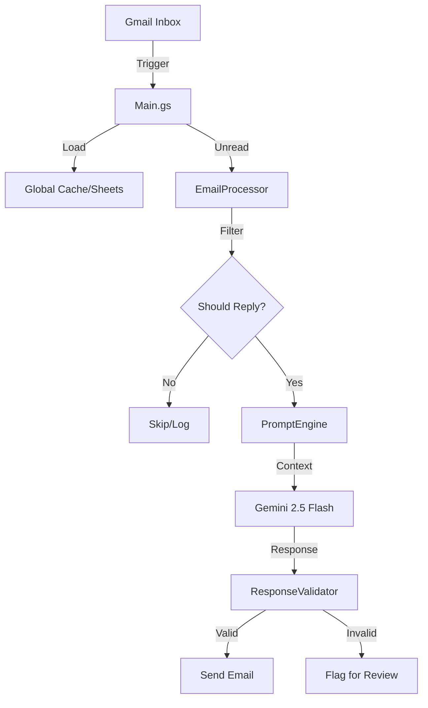

# System Architecture

## Overview

exnovoGAS follows a modular, service-oriented architecture designed within the constraints of the Google Apps Script environment.

### Core Modules

1.  **Main.gs (`gas_main.js`)**:
    *   **Orchestrator**: Entry point for time-based triggers.
    *   **Resource Loader**: Loads KB and configuration into `GLOBAL_CACHE`.
    *   **Suspension Logic**: Handles operational hours and holidays.

2.  **EmailProcessor (`gas_email_processor.js`)**:
    *   **Pipeline Manager**: Manages the flow of `Filter -> Classify -> Generate -> Validate`.
    *   **Concurrency Control**: Uses `LockService` to prevent race conditions on single threads.

3.  **GeminiService (`gas_gemini_service.js`)**:
    *   **AI Interface**: Wraps Google Gemini API calls.
    *   **Adaptive Logic**: Handles dynamic prompts and fallback models.

4.  **PromptEngine (`gas_prompt_engine.js`)**:
    *   **Prompt Builder**: Assembles complex prompts from 18+ modular templates.
    *   **Context Awareness**: Injects seasonal, liturgical, and conversation context.

5.  **RateLimiter (`gas_rate_limiter.js`)**:
    *   **Quota Management**: Tracks RPM/RPD usage to avoid Google API limits.
    *   **Token Estimation**: Adaptive token counting.

### Data Flow

### Key Design Decisions

*   **Atomic Locking**: Critical for preventing duplicate replies when multiple triggers fire overlapping executions.
*   **Fail-Open / Fail-Safe**: Different strategies for different components. E.g., if checking an ignored domain fails, we default to processing (fail-open) to avoid missing legitimate emails.
*   **Structured Logging**: All logs are JSON-formatted for ingestion by cloud monitoring tools (if configured).
