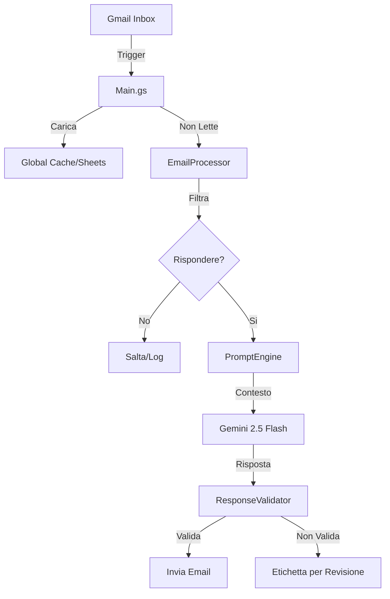

# Architettura di Sistema

## Panoramica

exnovoGAS segue un'architettura modulare orientata ai servizi, progettata all'interno dei vincoli dell'ambiente Google Apps Script.

### Moduli Principali

1.  **Main.gs (`gas_main.js`)**:
    *   **Orchestratore**: Punto di ingresso per i trigger temporali.
    *   **Resource Loader**: Carica KB e configurazione nella `GLOBAL_CACHE`.
    *   **Logica Sospensione**: Gestisce orari operativi e festività.

2.  **EmailProcessor (`gas_email_processor.js`)**:
    *   **Gestore Pipeline**: Gestisce il flusso `Filtra -> Classifica -> Genera -> Valida`.
    *   **Controllo Concorrenza**: Usa `LockService` per prevenire race conditions sui thread.

3.  **GeminiService (`gas_gemini_service.js`)**:
    *   **Interfaccia AI**: Wrapper per le chiamate API di Google Gemini.
    *   **Logica Adattiva**: Gestisce prompt dinamici e modelli di fallback.

4.  **PromptEngine (`gas_prompt_engine.js`)**:
    *   **Prompt Builder**: Assembla prompt complessi da 18+ template modulari.
    *   **Consapevolezza Contesto**: Inietta contesto stagionale, liturgico e conversazionale.

5.  **RateLimiter (`gas_rate_limiter.js`)**:
    *   **Gestione Quote**: Traccia l'uso di RPM/RPD per evitare i limiti API Google.
    *   **Stima Token**: Conteggio adattivo dei token.

### Flusso Dati

### Decisioni di Design Chiave

*   **Locking Atomico**: Cruciale per prevenire risposte duplicate quando trigger multipli sovrappongono le esecuzioni.
*   **Fail-Open / Fail-Safe**: Strategie diverse per componenti diversi. Es. se il controllo domini ignorati fallisce, processiamo comunque (fail-open) per evitare di perdere email legittime.
*   **Logging Strutturato**: Tutti i log sono formattati JSON per ingestione da strumenti di cloud monitoring.
