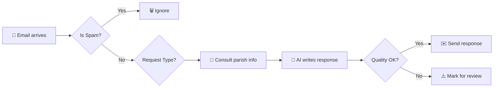

# 📧 Parish Email Secretary AI

[](LICENSE)
[](README_IT.md)
[]

> **An intelligent AI assistant that manages your parish emails with pastoral sensitivity, doctrinal accuracy, and operational efficiency.**

---

## 🎯 What this system does

**In simple terms:** When someone writes to the parish, the system reads the email, understands what is needed, consults available information (mass times, activities, sacrament documents), and automatically responds in a professional and pastoral manner.

### Real use cases

✅ **"What time is Sunday Mass?"** → Immediate response with current schedule  
✅ **"I would like to have my child baptized"** → Complete info on documents, dates, course  
✅ **"I live at Via Roma 10, am I in your parish?"** → Automatic territory verification  
✅ **"I have a personal problem and would like to speak with a priest"** → Empathetic tone + direct contacts  
✅ **Email in English/Spanish** → Response in the same language  

### ✨ NEW in v2.5: Prompt Engine Optimization & Smart RAG
*   **Modular Dynamic Prompt**: The prompt is built "on the fly" assembling only necessary blocks (e.g., no Sacrament rules if talking about Mass Times), saving tokens and increasing precision.
*   **Smart RAG (Doctrine)**: Advanced integration with Doctrine. Specific directives, examples, and warnings are loaded dynamically based on the topic, allowing pinpoint pastoral guidance.
*   **Contextual Checklists**: Every response is verified against a checklist that adapts to the language and territory (e.g., specific checks for Roman addresses).
*   **Anti-Leak & Sanitization**: Advanced protection against AI "thought" leaks and automatic input sanitization for sensitive templates (e.g., Formal requests).
*   **OCR Attachment Support**: Automatic reading and understanding of attached PDFs and images (e.g., IBANs, documents) to enrich response context.

### ✨ NEW in v2.4: Advanced Intelligence
*   **Self-Healing**: Automatically fixes common errors (typos, duplicate links) before sending.
*   **Multi-Dimensional Analysis**: Understands not just the topic, but the **emotional load** and **complexity**.
*   **Reactive Memory**: Remembers if you understood ("Thanks!") or are confused ("I don't get it") and adapts the next reply.
*   **Smart Active Listening (Anti-Redundancy)**: If the user says "I already have the form", the AI avoids sending the link again.
*   **Linguistic Correctness & Style**: The AI always uses correct grammar (e.g. "il canale") even if the user makes a typo ("la canale"), silently ignoring the error.

---

## ⚡ Immediate Benefits

| For the Secretariat | For the Faithful | For Priests |
|-------------------|--------------|---------------|
| ⏰ Reduces repetitive email load | 📱 Immediate responses 24/7 | 🎯 More time for pastoral care |
| 📊 Handles 70-80% of simple requests | 🌍 Multilingual support | 📈 Request statistics |
| 🔄 No more "sorry for the delay" | ✅ Always up-to-date info | 🛡️ Automatic spam filter |
| 📚 Consistency in responses | 💬 Professional and welcoming tone | 🔍 Highlights cases needing human attention |

---

## 🚀 How It Works (Non-Technical)



**No email is deleted.** The system only adds labels:
- 🟢 **"IA"** = Reply sent successfully
- 🟡 **"Verifica"** = Reply generated but needs checking before sending
- 🔴 **"Errore"** = Technical problem, check manually

---

## 📋 Minimum Requirements

- ✅ **Parish Gmail Account** (e.g. `info@parishexample.org` on Gmail)
- ✅ **Google Drive** (free, to store information)
- ✅ **5 minutes** for initial configuration
- ✅ **No technical skills** (we have step-by-step guides)

### Costs

| Component | Cost | Notes |
|------------|-------|------|
| Gmail | Free | Existing account |
| Google Drive | Free | Standard quota sufficient |
| Google Apps Script | Free | Hosting included |
| Gemini AI API | **Free** | Up to 50 emails/day with free tier |

💡 **Note:** Within the free tier limits (50 emails/day), the system is **completely free**.

---

## 👀 System at a Glance

```
┌─────────────────────────────────────────────────────────┐
│  📧 EMAIL ARRIVES                                       │
│  └─► 🤖 System reads every 5 minutes                    │
└─────────────────────────────────────────────────────────┘
                        │
                        ▼
        ┌───────────────────────────────┐
        │ 🧹 SMART FILTERS              │
        │ • Spam/Newsletter → Ignore    │
        │ • Acknowledgment → Ignore     │
        │ • Real question → Process     │
        └───────────────┬───────────────┘
                        │
                        ▼
        ┌───────────────────────────────┐
        │ 🧠 CLASSIFY REQUEST           │
        │ • Technical → KB Lite         │
        │ • Pastoral → KB Heavy         │
        │ • Doctrinal → KB + Doctrine   │
        │ • Territory → Address Check   │
        └───────────────┬───────────────┘
                        │
                        ▼
        ┌───────────────────────────────┐
        │ 🤖 GENERATE RESPONSE (Gemini) │
        │ • Uses Knowledge Base         │
        │ • Respects email language     │
        │ • Professional/warm tone      │
        └───────────────┬───────────────┘
                        │
                        ▼
        ┌───────────────────────────────┐
        │ ✅ VALIDATE QUALITY           │
        │ • Length OK?                  │
        │ • Correct language?           │
        │ • No hallucinations?          │
        └───────────────┬───────────────┘
                        │
                ┌───────┴───────┐
                │               │
             ✅ OK          ❌ FAIL
                │               │
                ▼               ▼
        ┌──────────────┐  ┌──────────────┐
        │ 📤 SEND      │  │ ⚠️ REVIEW    │
        │ + Label "IA" │  │ Human Needed │
        └──────────────┘  └──────────────┘
```

---

## 🔄 Compatibility and Dependencies

| Component | Minimum Version | Tested Version | Notes |
|-----------|-----------------|----------------|-------|
| Google Apps Script Runtime | V8 | V8 | **Required** |
| Gemini API | 1.5 Flash | 2.5 Flash | 2.5 recommended |
| Google Sheets API | v4 | v4 | - |
| Gmail API | v1 | v1 | Advanced Service |
| Node.js (for clasp) | 14+ | 20 LTS | Development only |

### Breaking Changes Between Versions

**2.3.x → 2.4.x**
- ⚠️ `CONFIG.GEMINI_MODELS` now mandatory
- ⚠️ `VALIDATION_STRICT_MODE` removed (use `VALIDATION_MIN_SCORE` instead)

---

## 🎓 Complete Guides

### To Start

1. 📖 **[Complete Setup Guide](docs/Setup_Guide_Non_Technical.md)** ← **Start here!**
   - Step-by-step installation with screenshots
   - No technical skills required
   - Time: ~15 minutes

2. 🔧 **[Advanced Configuration](docs/CONFIGURATION.md)**
   - Customize hours, languages, response tone
   - Configure parish territory
   - Holiday management

3. 📚 **[Knowledge Base Population](docs/KNOWLEDGE_BASE_GUIDE.md)**
   - How to insert mass times, events, documents
   - Ready-made templates
   - Best practices

### For Technical Users

4. 🏗️ **[System Architecture](docs/ARCHITECTURE.md)**
   - Design patterns and technical decisions
   - Processing flow
   - APIs and integrations

5. 🧪 **[Testing and Debug](docs/TROUBLESHOOTING.md)**
   - Unit and integration tests
   - Troubleshooting common scenarios
   - Performance monitoring

6. 🔒 **[Security and Privacy](docs/SECURITY.md)**
   - Sensitive data management
   - GDPR compliance
   - Backup and disaster recovery

---

## 🎯 Quick Start (5 Minutes)

**Just to get an idea of the system in action:**

```javascript
// 1. Open Google Apps Script (script.google.com)
// 2. Create new project
// 3. Copy this test code

function testQuickDemo() {
  // Simulate a request
  const emailTest = {
    subject: "Mass Times",
    body: "Good morning, I would like to know Sunday mass times. Thanks",
    from: "john.doe@example.com"
  };
  
  // Classify the request
  const classifier = new Classifier();
  const result = classifier.classifyEmail(emailTest.subject, emailTest.body);
  
  console.log("Request Type:", result.category);
  console.log("Needs Reply?", result.shouldReply);
  console.log("Detected Language:", result.language);
}

// Run this function to see classification in action
```

---

## 🌟 Unique Features

### 🧠 Pastoral Intelligence

The system **is not a simple chatbot**. It distinguishes between:

- **Bureaucratic requests** → Efficient and clear tone
- **Pastoral situations** → Empathetic tone, suggests interview with priest
- **Doctrinal doubts** → Responds with references to Catechism, Magisterium

**Real example:**
```
Email: "I am divorced and civilly remarried, can I be a confirmation sponsor?"

AI Response: "Thank you for your trust. The situation of those who are divorced 
and civilly remarried requires personalized pastoral discernment. 
I advise you to speak directly with Father Mark by calling 06-1234567 
or stopping by the office. We will be happy to accompany you."
```

### 🌍 Native Multilingual

- **Automatic detection** of language (IT/EN/ES/FR/DE)
- **Response in same language** as received email
- **No manual configuration** needed

### 🗺️ Automatic Territory Verification

```
Email: "I live at Via Flaminia 150, does it fall within your parish?"

System: 
1. Extracts "Via Flaminia 150"
2. Verifies in territory database
3. Responds: "Yes, Via Flaminia from 109 to 217 (odd) falls within 
   our territory. We will be happy to welcome you!"
```

### 🔄 Conversational Memory

The system **remembers** previous conversations:
- Does not repeat information already provided
- Adapts greeting (first contact vs follow-up)
- Maintains discussion context

### 🛡️ Safety and Anti-Loop Logic

The system implements rigorous protocols to ensure relevant responses and avoid repetitions:
- **Fail-Closed Philosophy**: In case of uncertainty about the need to respond, the system prioritizes silence to avoid bothering the user with unnecessary or repetitive messages.
- **"Last Speaker" Check**: Before each process, the bot verifies who sent the last message in the thread. If the last message is from the secretariat (or the bot), processing stops immediately, avoiding infinite loops.
- **Advanced No-Reply Detection**: Automatically filters emails from automated systems by analyzing both the address and the sender's display name.

### ⚙️ Automatic Safety Valve

If API usage exceeds 80%, the system:
- ⚡ Automatically reduces number of processed emails
- 📊 Sends alert to manager
- 🔄 Adapts without interrupting service

---

## 🛡️ Security and Privacy

### GDPR Compliance

- ✅ **No data saved on external servers** (everything on Google Workspace)
- ✅ **No emails sent to third parties** for AI training
- ✅ **Conversational memory deletable** at any time
- ✅ **Complete audit log** of all operations

### Multi-Level Quality Control

Every response is **automatically validated** before sending:

1. ✅ Appropriate length (neither too short nor verbose)
2. ✅ Correct language (IT/EN/ES/FR/DE)
3. ✅ Absence of "hallucinations" (invented data)
4. ✅ Professional but warm tone
5. ✅ Signature present
6. ✅ No sensitive information exposed

**If a single validation fails:** Email labeled "Verifica" for human check.

---

## 🆘 Support

### Common Problems

**Q: The system does not reply to emails**
```
Check:
1. Is trigger active? (Trigger → must have "main" every 5 min)
2. Office hours configured? (System suspends outside office hours)
3. Check Executions → look for errors
```

**Q: Responses in wrong language**
```
Cause: Email with mixed words
Solution: System uses "linguistic prevalence". If email has 
          "Grazie" and "Thank you", counts which language is more present.
```

**Q: Too many emails marked "Verifica"**
```
Cause: Validation threshold too high
Solution: In Config.gs, change VALIDATION_MIN_SCORE from 0.6 to 0.5
```

### Contacts

- 📧 **Email:** info@parrocchiasanteugenio.it
- 📚 **Wiki:** [Complete Documentation](docs/)

---

## 🤝 Contributing

This project is **open source** and welcomes contributions from:
- 👨‍💻 **Developers** → Code improvements, new features
- ⛪ **Pastoral workers** → Feedback on response tone, use cases
- 🌍 **Translators** → New language support
- 📚 **Documenters** → Guides, tutorials, examples

See [CONTRIBUTING.md](docs/CONTRIBUTING.md) for details.

---

## 📜 License

This project is released under **MIT** license - see [LICENSE](LICENSE).

**In practice:** You can use it, modify it, share it freely even for commercial purposes. We only ask to cite the original project.

---

## 🙏 Acknowledgements

Developed with ❤️ for parish communities by volunteers and professionals.

**Special thanks to:**
- St. Eugene Parish (Rome) - Beta testing and feedback
- Google AI Team - Gemini API
- All open source contributors

---

## 📈 Roadmap

**Future ideas:**
- [x] OCR attachments processing (PDF and images) - **IMPLEMENTED v2.5**
- [ ] Google Calendar integration for bookings
- [ ] SMS notifications for urgency
- [ ] Mobile app for secretariat management
- [ ] Web dashboard for statistics
- [ ] WhatsApp Business Integration

---

## ⭐ Star the Project!

If this system is useful for your parish, leave a ⭐ on GitHub!
Helps other communities discover it.

---

## 📖 Technical Glossary

| Term | Definition | Example |
|------|------------|---------|
| **RPM** | Requests Per Minute - API requests per minute | 10 RPM = max 10 calls/min |
| **TPM** | Tokens Per Minute - Tokens consumed per minute | 250k TPM = generous budget |
| **RPD** | Requests Per Day - Daily requests | 250 RPD = ~10/hour in 24h |
| **KB** | Knowledge Base - Information database | "Mass times: 6:00 PM" |
| **DRY_RUN** | Test mode without sending emails | `CONFIG.DRY_RUN = true` |
| **Salutation Mode** | Greeting type (full/soft/none) | `full` = first contact |
| **Thinking Leak** | AI exposes internal reasoning | "Reviewing the KB..." ❌ |
| **ReDoS** | Regex Denial of Service - Regex attack | `(a+)+b` with `aaaa...c` |
| **Safety Valve** | Automatic load reduction if quota >80% | Prevents quota exhaustion |
| **Label** | Gmail label to categorize emails | "IA", "Verifica", "Errore" |

---

**[Versione Italiana](README_IT.md)** | **[Troubleshooting](docs/TROUBLESHOOTING.md)** | **[Deployment](docs/DEPLOYMENT.md)** | **[Architecture](docs/ARCHITECTURE.md)**
