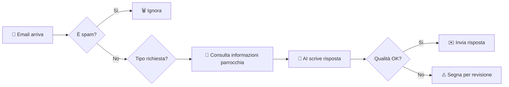

# 📧 Segreteria Email Parrocchiale AI

[](LICENSE) 
[](README_IT.md)
[](README.md)
[]

> **Un assistente AI intelligente che gestisce le email della tua parrocchia con sensibilità pastorale, accuratezza dottrinale ed efficienza operativa.**

---

## 🎯 Cosa fa questo sistema

**In parole semplici:** Quando qualcuno scrive alla parrocchia, il sistema legge l'email, capisce cosa serve, consulta le informazioni disponibili (orari messe, attività, documenti per sacramenti) e risponde automaticamente in modo professionale e pastorale.

### Casi d'uso reali

✅ **"A che ora è la messa domenicale?"** → Risposta immediata con orari correnti  
✅ **"Vorrei far battezzare mio figlio"** → Info complete su documenti, date, corso  
✅ **"Abito in Via Roma 10, rientro nella vostra parrocchia?"** → Verifica automatica del territorio  
✅ **"Ho un problema personale e vorrei parlare con un sacerdote"** → Tono empatico + contatti diretti  
✅ **Email in inglese/spagnolo** → Risposta nella stessa lingua  

### ✨ Versione 2.0: Solidità & Affidabilità
*   **Gestione Lock Avanzata**: Ottimizzazione dei lock atomici per una coordinazione perfetta dei processi.
*   **Gestione Semantica KB**: Troncamento intelligente della Knowledge Base per garantire risposte sempre complete e coerenti.
*   **Resilienza Operativa**: Sistema di monitoraggio delle quote integrato per una continuità di servizio costante.
*   **Raffinamento Validazione**: Controlli qualitativi estesi per una precisione millimetrica nell'interazione.
*   **Prompt Engine Modulare**: Assemblaggio dinamico del contesto per massimizzare la pertinenza di ogni risposta.
*   **Smart RAG (Dottrina)**: Integrazione profonda con il magistero e le direttive parrocchiali.
> ℹ️ **Nota operativa**: il blocco Dottrina è caricato in cache ma viene incluso nel prompt solo quando il classifier rileva una necessità dottrinale (`needsDoctrine`) o un topic pertinente. È normale che, in casistiche reali, le email dottrinali siano una minoranza.
*   **Eccellenza Linguistica**: Gestione raffinata di grammatica e stili formali (es. nomi sacri).
*   **Analisi Multi-Dimensionale**: Comprensione del carico emotivo e della complessità delle richieste.
*   **Supporto OCR Integrato**: Elaborazione automatica di allegati e immagini per un contesto arricchito.

---

## ⚡ Vantaggi Immediati

| Per la Segreteria | Per i Fedeli | Per i Parroci |
|-------------------|--------------|---------------|
| ⏰ Riduce il carico di email ripetitive | 📱 Risposte immediate 24/7 | 🎯 Più tempo per la pastorale |
| 📊 Gestisce 70-80% delle richieste semplici | 🌍 Supporto multilingua | 📈 Statistiche sulle richieste |
| 🔄 Niente più "scusa il ritardo" | ✅ Informazioni sempre aggiornate | 🛡️ Filtro anti-spam automatico |
| 📚 Coerenza nelle risposte | 💬 Tono professionale e accogliente | 🔍 Evidenzia casi che necessitano attenzione umana |

---

## 🚀 Come Funziona (per non tecnici)



**Nessuna email viene cancellata.** Il sistema aggiunge solo delle etichette:
- 🟢 **"IA"** = Risposta inviata con successo
- 🟡 **"Verifica"** = Risposta generata ma da controllare prima dell'invio
- 🔴 **"Errore"** = Richiesta di intervento manuale

---

## 📋 Requisiti Minimi

- ✅ **Account Gmail della parrocchia** (es. `info@parrocchiaexample.it` su Gmail)
- ✅ **Google Drive** (gratis, per memorizzare le informazioni)
- ✅ **5 minuti** per la configurazione iniziale
- ✅ **Nessuna competenza tecnica** (abbiamo guide passo-passo)

### Costi

| Componente | Costo | Note |
|------------|-------|------|
| Gmail | Gratis | Account esistente |
| Google Drive | Gratis | Quota standard sufficiente |
| Google Apps Script | Gratis | Hosting incluso |
| API Gemini AI | **Gratis** | Fino a 50 email/giorno con la free tier |

💡 **Nota:** Entro i limiti della free tier (50 email/giorno), il sistema è **completamente gratuito**.

---

## 👀 Sistema a Colpo d'Occhio

```
┌─────────────────────────────────────────────────────────┐
│  📧 EMAIL ARRIVA                                        │
│  └─► 🤖 Sistema legge ogni 5 minuti                     │
└─────────────────────────────────────────────────────────┘
                        │
                        ▼
        ┌───────────────────────────────┐
        │ 🧹 FILTRI INTELLIGENTI        │
        │ • Spam/Newsletter → Ignora    │
        │ • Acknowledgment → Ignora     │
        │ • Domanda vera → Processa     │
        └───────────────┬───────────────┘
                        │
                        ▼
        ┌───────────────────────────────┐
        │ 🧠 CLASSIFICA RICHIESTA       │
        │ • Tecnica → KB Lite           │
        │ • Pastorale → KB Heavy        │
        │ • Dottrinale → KB + Dottrina  │
        │ • Territorio → Verifica Ind.  │
        └───────────────┬───────────────┘
                        │
                        ▼
        ┌───────────────────────────────┐
        │ 🤖 GENERA RISPOSTA (Gemini)   │
        │ • Usa Knowledge Base          │
        │ • Rispetta lingua email       │
        │ • Gestisce ritardi (>3gg)     │
        │ • Tono professionale/caloroso │
        └───────────────┬───────────────┘
                        │
                        ▼
        ┌───────────────────────────────┐
        │ ✅ VALIDA QUALITÀ             │
        │ • Lunghezza OK?               │
        │ • Lingua corretta?            │
        │ • Nessuna allucinazione?      │
        └───────────────┬───────────────┘
                        │
                ┌───────┴───────┐
                │               │
             ✅ OK          ❌ FAIL
                │               │
                ▼               ▼
        ┌──────────────┐  ┌──────────────┐
        │ 📤 INVIA     │  │ ⚠️ VERIFICA  │
        │ + Label "IA" │  │ Umana Needed │
        └──────────────┘  └──────────────┘
```

---

## 🔄 Compatibilità e Dipendenze

| Componente | Versione Minima | Versione Testata | Note |
|------------|-----------------|------------------|------|
| Google Apps Script Runtime | V8 | V8 | **Obbligatorio** |
| Gemini API | 1.5 Flash | 2.5 Flash | 2.5 raccomandato |
| Google Sheets API | v4 | v4 | - |
| Gmail API | v1 | v1 | Advanced Service |
| Node.js (per clasp) | 14+ | 20 LTS | Solo sviluppo |

### Breaking Changes tra Versioni

**2.3.x → 2.4.x**
- ⚠️ `CONFIG.GEMINI_MODELS` ora obbligatorio
- ⚠️ `VALIDATION_STRICT_MODE` rimosso (usa invece `VALIDATION_MIN_SCORE`)

---

## 🎓 Guide Complete

### Per Iniziare

1. 📖 **[Guida Setup Completa](docs/Guida_Setup_Completa_Per_non_tecnici.md)** ← **Parti da qui!**
   - Installazione passo-passo con screenshot
   - Nessuna competenza tecnica richiesta
   - Tempo: ~15 minuti

2. 🔧 **[Configurazione Avanzata](docs/CONFIGURATION_IT.md)**
   - Personalizza orari, lingue, tono risposte
   - Configura territorio parrocchiale
   - Gestione festività

3. 📚 **[Popolamento Knowledge Base](docs/KNOWLEDGE_BASE_GUIDE_IT.md)**
   - Come inserire orari messe, eventi, documenti
   - Template già pronti
   - Best practices

### ⚠️ Note Importanti sulla Configurazione

   > **PRIORITÀ CONFIGURAZIONE:**
   > In ambiente di produzione, le **Script Properties** hanno la priorità assoluta su `gas_config.js`.
   >
   > Se imposti `GEMINI_API_KEY` o `SPREADSHEET_ID` nelle **Impostazioni Progetto > Proprietà dello script**, questi valori sovrascriveranno quanto scritto nel codice `CONFIG`.
   > Questo è fondamentale per la sicurezza (non salvare mai chiavi reali nel file `gas_config.js`).

### Per Utenti Tecnici

4. 🏗️ **[Architettura Sistema](docs/ARCHITECTURE_IT.md)**
   - Design pattern e decisioni tecniche
   - Flusso elaborazione
   - API e integrazioni

5. 🧪 **[Testing e Debug](docs/TROUBLESHOOTING_IT.md)**
   - Test unitari e integrazione
   - Troubleshooting scenari comuni
   - Performance monitoring

6. 🔒 **[Sicurezza e Privacy](docs/SECURITY_IT.md)**
   - Gestione dati sensibili
   - Conformità GDPR
   - Backup e disaster recovery

---

## 🎯 Quick Start (5 Minuti)

**Solo per avere un'idea del sistema in azione:**

```javascript
// 1. Apri Google Apps Script (script.google.com)
// 2. Crea nuovo progetto
// 3. Copia questo codice di test

function testQuickDemo() {
  // Simula una richiesta
  const emailTest = {
    subject: "Orari messe",
    body: "Buongiorno, vorrei sapere gli orari delle messe domenicali. Grazie",
    from: "mario.rossi@example.com"
  };
  
  // Classifica la richiesta
  const classifier = new Classifier();
  const result = classifier.classifyEmail(emailTest.subject, emailTest.body);
  
  console.log("Tipo richiesta:", result.category);
  console.log("Richiede risposta?", result.shouldReply);
  console.log("Lingua rilevata:", result.language);
}

// Esegui questa funzione per vedere la classificazione in azione
```

---

## 🌟 Caratteristiche Uniche

### 🧠 Intelligenza Pastorale

Il sistema **non è un semplice chatbot**. Distingue tra:

- **Richieste burocratiche** → Tono efficiente e chiaro
- **Situazioni pastorali** → Tono empatico, suggerisce colloquio con sacerdote
- **Dubbi dottrinali** → Risponde con riferimenti al Catechismo, Magistero

**Esempio reale:**
```
Email: "Sono divorziato e risposato civilmente, posso fare da padrino di cresima?"

Risposta AI: "La ringrazio per la fiducia. La situazione di chi è divorziato 
e risposato civilmente necessita di un discernimento pastorale personalizzato.
Le consiglio di parlarne direttamente con don Marco chiamando al 06-1234567 
o passando in segreteria. Saremo lieti di accompagnarla."
```

### 🌍 Multilingua Nativo

- **Rilevamento automatico** della lingua (IT/EN/ES/FR/DE)
- **Risposta nella stessa lingua** dell'email ricevuta
- **Nessuna configurazione manuale** necessaria

### 🗺️ Verifica Territorio Automatica

```
Email: "Abito in Via Flaminia 150, rientro nella vostra parrocchia?"

Sistema: 
1. Estrae "Via Flaminia 150"
2. Verifica nel database territorio
3. Risponde: "Sì, Via Flaminia dal 109 al 217 (dispari) rientra nel 
   nostro territorio. Saremo lieti di accoglierla!"
```

### 🔄 Memoria Conversazionale

Il sistema **ricorda** le conversazioni precedenti:
- Non ripete informazioni già fornite
- Adatta il saluto (primo contatto vs follow-up)
- Mantiene il contesto della discussione

### 🛡️ Logiche di Sicurezza e Anti-Loop

Il sistema implementa protocolli rigorosi per garantire risposte pertinenti ed evitare ripetizioni:
- **Filosofia Fail-Closed**: In caso di incertezza sulla necessità di rispondere, il sistema privilegia il silenzio per evitare di disturbare l'utente con messaggi non necessari o ripetitivi.
- **Controllo "Last Speaker"**: Prima di ogni elaborazione, il bot verifica chi ha inviato l'ultimo messaggio nel thread. Se l'ultimo messaggio è già della segreteria (o del bot), l'elaborazione si ferma, evitando loop infiniti.
- **Rilevamento No-Reply avanzato**: Filtra automaticamente le email provenienti da sistemi automatizzati analizzando sia l'indirizzo che il nome del mittente.

### ⚙️ Safety Valve Automatica

Se l'API usage supera l'80%, il sistema:
- ⚡ Riduce automaticamente il numero di email processate
- 📊 Invia alert al gestore
- 🔄 Si adatta senza interrompere il servizio

---

## 🛡️ Sicurezza e Privacy

### Conformità GDPR

- ✅ **Nessun dato salvato su server esterni** (tutto su Google Workspace)
- ✅ **Nessuna email inviata a terzi** per training AI
- ✅ **Memoria conversazionale cancellabile** in qualsiasi momento
- ✅ **Audit log completo** di tutte le operazioni

### Controllo Qualità Multi-Livello

Ogni risposta viene **validata automaticamente** prima dell'invio:

1. ✅ Lunghezza appropriata (né troppo corta né prolissa)
2. ✅ Lingua corretta (IT/EN/ES/FR/DE)
3. ✅ Assenza di "allucinazioni" (dati inventati)
4. ✅ Tono professionale ma caloroso
5. ✅ Firma presente
6. ✅ Nessuna informazione sensibile esposta

**Se una sola validazione fallisce:** Email etichettata "Verifica" per controllo umano.

---

## 🆘 Supporto

### Problemi Comuni

**Q: Il sistema non risponde alle email**
```
Verifica:
1. Il trigger è attivo? (Trigger → deve esserci "processEmailsMain" ogni 5 min)
2. Orario di lavoro configurato? (Sistema si sospende fuori orari ufficio)
3. Controlla Esecuzioni → cerca errori
```

**Q: Risposte in lingua sbagliata**
```
Causa: Email con parole miste
Soluzione: Sistema usa "prevalenza linguistica". Se email ha 
          "Grazie" e "Thank you", conta quale lingua è più presente.
```

**Q: Troppe email marcate "Verifica"**
```
Causa: Soglia validazione troppo alta
Soluzione: In gas_config_s.js, cambia VALIDATION_MIN_SCORE da 0.6 a 0.5
```

### Contatti

- 📧 **Email:** info@parrocchiasanteugenio.it
- 📚 **Wiki:** [Documentazione Completa](docs/)

---

## 🤝 Contribuire

Questo progetto è **open source** e accoglie contributi da:
- 👨‍💻 **Developer** → Miglioramenti codice, nuove feature
- ⛪ **Operatori pastorali** → Feedback su tono risposte, casi d'uso
- 🌍 **Traduttori** → Supporto nuove lingue
- 📚 **Documentatori** → Guide, tutorial, esempi
- 🐛 **Tester** → Segnalazione bug

Leggi [CONTRIBUTING_IT.md](docs/CONTRIBUTING_IT.md) per i dettagli.

---

## 📜 Licenza

Questo progetto è rilasciato sotto licenza **MIT** - vedi [LICENSE](LICENSE).

**In pratica:** Puoi usarlo, modificarlo, condividerlo liberamente anche per scopi commerciali. Chiediamo solo di citare il progetto originale.

---

## 🙏 Ringraziamenti

Sviluppato con ❤️ per le comunità parrocchiali da volontari e professionisti.

**Ringraziamenti speciali a:**
- Parrocchia Sant'Eugenio (Roma) - Beta testing e feedback
- Google AI Team - Gemini API
- Tutti i contributori open source

---

## 📈 Roadmap

**Idee future:**
- [x] OCR allegati (PDF e immagini) - **IMPLEMENTATO v2.5**
- [ ] Integrazione calendario Google per prenotazioni
- [ ] SMS notifications per urgenze
- [ ] App mobile per gestione segreteria
- [ ] Dashboard web per statistiche
- [ ] Integrazione WhatsApp Business

---

## ⭐ Stella il Progetto!

Se questo sistema è utile per la tua parrocchia, lascia una ⭐ su GitHub!
Aiuta altre comunità a scoprirlo.

---

## 📖 Glossario Termini Tecnici

| Termine | Definizione | Esempio |
|---------|-------------|---------|
| **RPM** | Requests Per Minute - Richieste API al minuto | 10 RPM = max 10 chiamate/min |
| **TPM** | Tokens Per Minute - Token consumati al minuto | 250k TPM = budget generoso |
| **RPD** | Requests Per Day - Richieste giornaliere | 250 RPD = ~10/ora in 24h |
| **KB** | Knowledge Base - Database informazioni | "Orari messe: 18:00" |
| **DRY_RUN** | Modalità test senza invio email | `CONFIG.DRY_RUN = true` |
| **Salutation Mode** | Tipo saluto (full/soft/none) | `full` = primo contatto |
| **Thinking Leak** | AI espone ragionamento interno | "Rivedendo la KB..." ❌ |
| **ReDoS** | Regex Denial of Service - Attacco regex | `(a+)+b` con `aaaa...c` |
| **Safety Valve** | Riduzione automatica carico se quota >80% | Previene esaurimento quota |
| **Label** | Etichetta Gmail per categorizzare email | "IA", "Verifica", "Errore" |

---

**[English Version](README.md)** | **[Troubleshooting](docs/TROUBLESHOOTING_IT.md)** | **[Deployment](docs/DEPLOYMENT_IT.md)** | **[Architettura](docs/ARCHITECTURE_IT.md)**