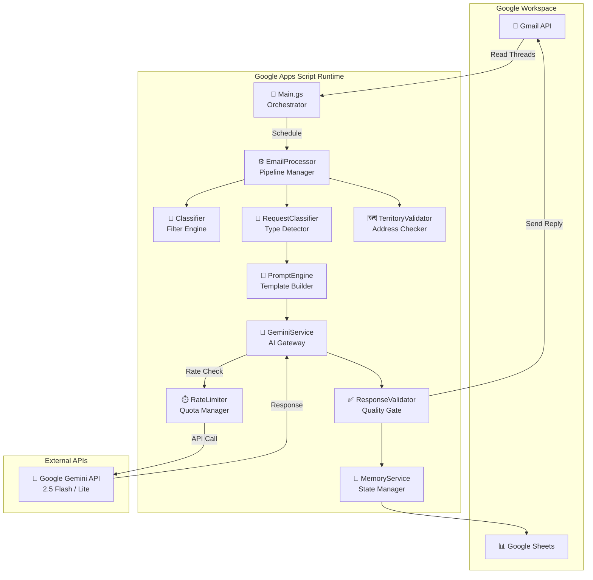
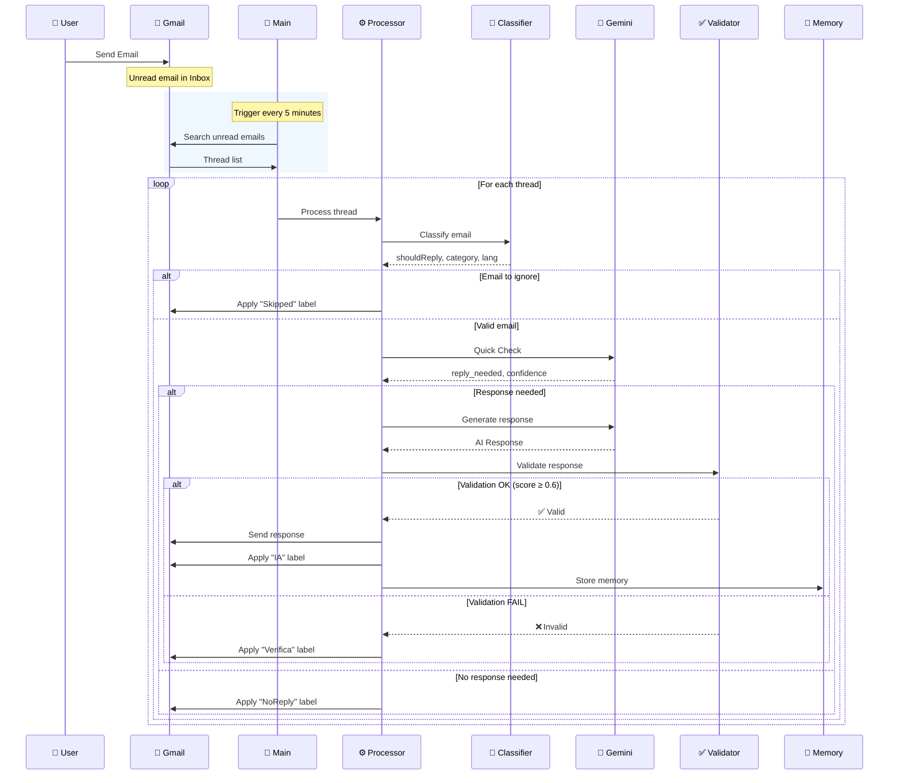
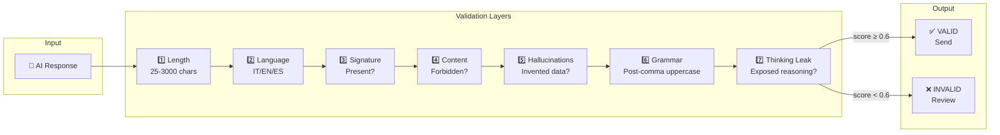
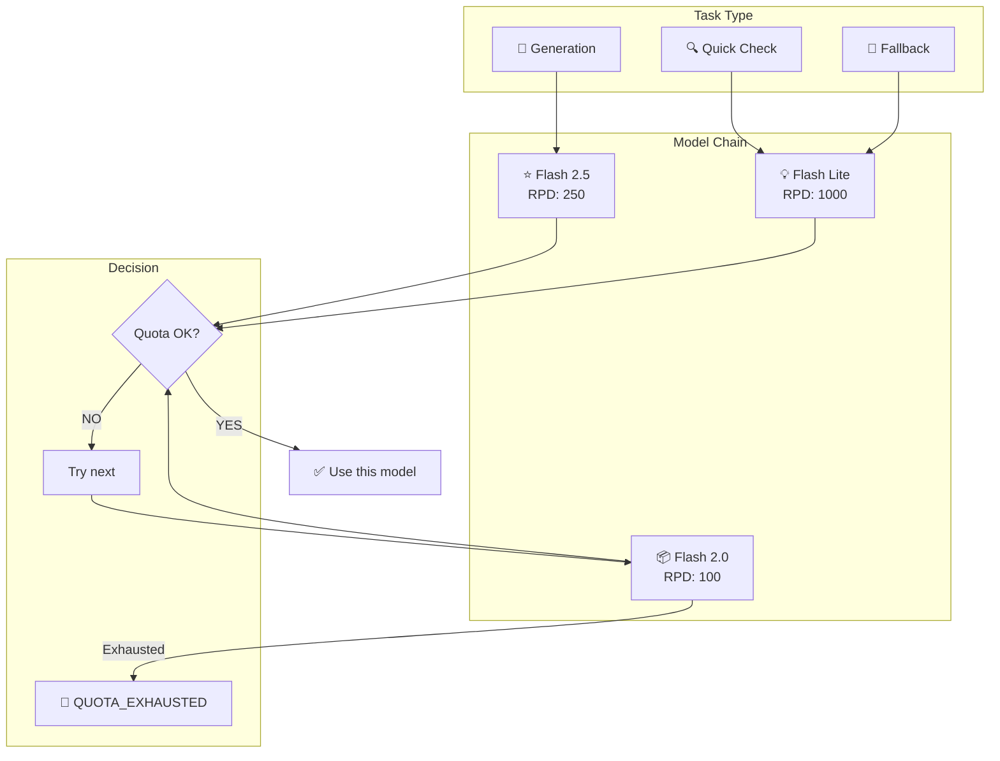
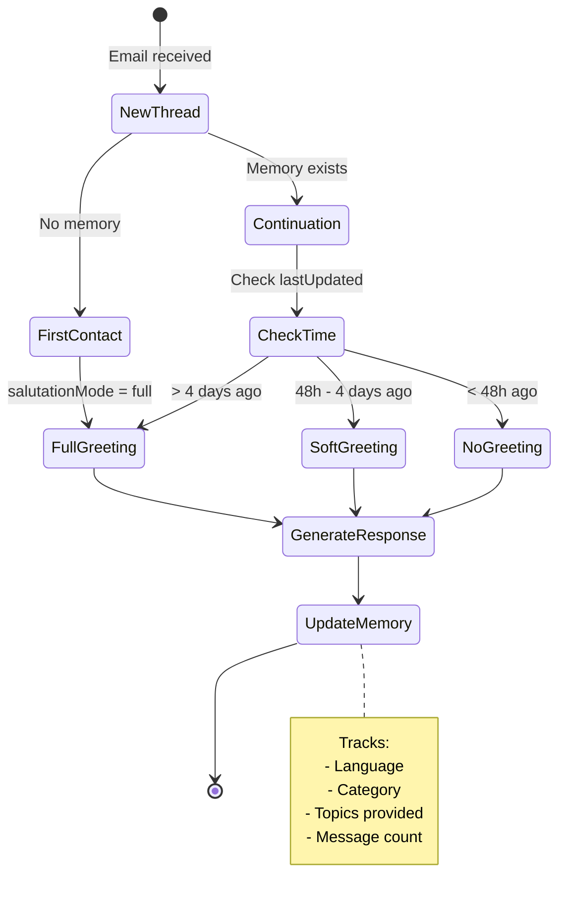
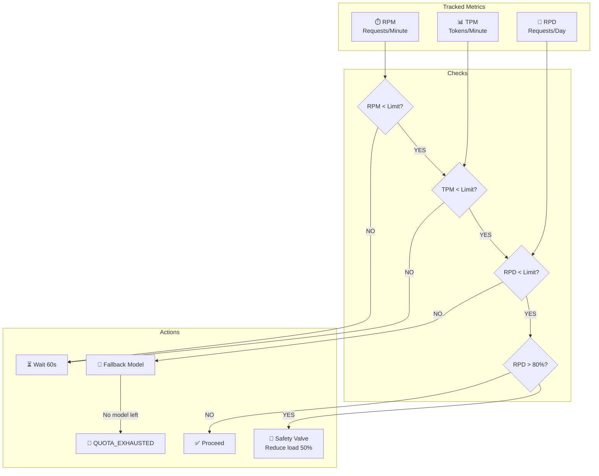
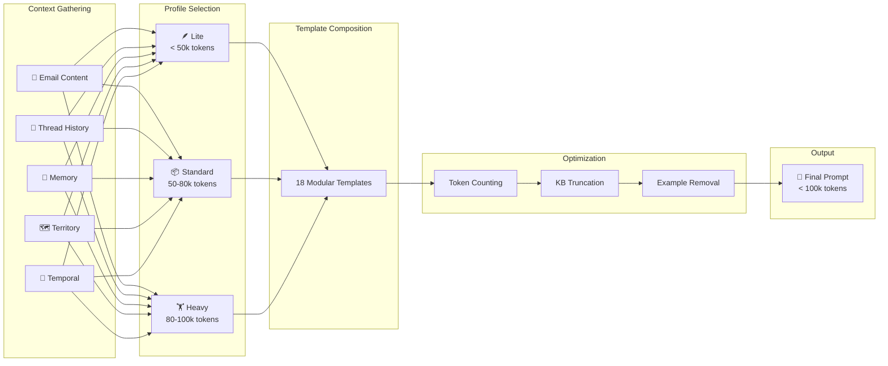
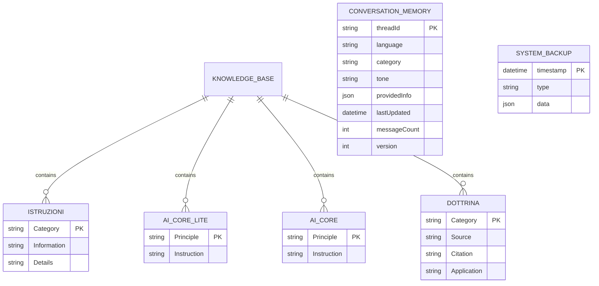
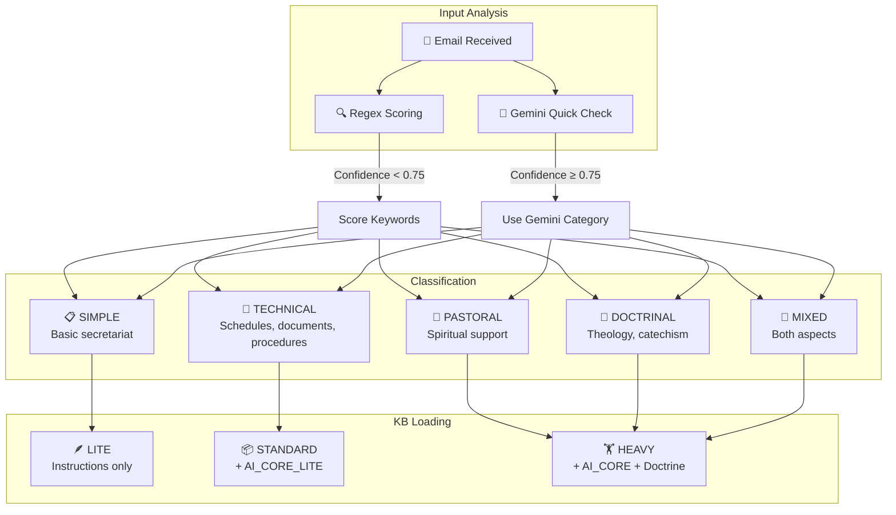

# 📐 System Architecture Diagrams

> **Complete visual representation of SPA (Segreteria Parrocchiale Automatica) architecture**

---

## 1. Component View (C4 Level 2)

```mermaid
graph TB
    subgraph "Google Workspace"
        Gmail["📧 Gmail API"]
        Sheets["📊 Google Sheets"]
    end
    
    subgraph "Google Apps Script Runtime"
        Main["🎯 Main.gs<br/>Orchestrator"]
        Proc["⚙️ EmailProcessor<br/>Pipeline Manager"]
        Class["🧹 Classifier<br/>Filter Engine"]
        ReqClass["🎨 RequestClassifier<br/>Type Detector"]
        Gemini["🤖 GeminiService<br/>AI Gateway"]
        Valid["✅ ResponseValidator<br/>Quality Gate"]
        Memory["💾 MemoryService<br/>State Manager"]
        Rate["⏱️ RateLimiter<br/>Quota Manager"]
        Prompt["📝 PromptEngine<br/>Template Builder"]
        Territory["🗺️ TerritoryValidator<br/>Address Checker"]
    end
    
    subgraph "External APIs"
        GeminiAPI["🧠 Google Gemini API<br/>2.5 Flash / Lite"]
    end
    
    Gmail -->|Read Threads| Main
    Main -->|Schedule| Proc
    Proc --> Class
    Proc --> ReqClass
    Proc --> Territory
    ReqClass --> Prompt
    Prompt --> Gemini
    Gemini -->|Rate Check| Rate
    Rate -->|API Call| GeminiAPI
    GeminiAPI -->|Response| Gemini
    Gemini --> Valid
    Valid --> Memory
    Memory --> Sheets
    Valid -->|Send Reply| Gmail
```

---

## 2. Email Data Flow (Sequence Diagram)

```mermaid
sequenceDiagram
    participant U as 👤 User
    participant G as 📧 Gmail
    participant M as 🎯 Main
    participant P as ⚙️ Processor
    participant C as 🧹 Classifier
    participant AI as 🤖 Gemini
    participant V as ✅ Validator
    participant S as 💾 Memory
    
    U->>G: Send Email
    Note over G: Unread email in Inbox
    
    rect rgb(240, 248, 255)
        Note over M: Trigger every 5 minutes
        M->>G: Search unread emails
        G->>M: Thread list
    end
    
    loop For each thread
        M->>P: Process thread
        
        P->>C: Classify email
        C-->>P: shouldReply, category, lang
        
        alt Email to ignore
            P->>G: Apply "Skipped" label
        else Valid email
            P->>AI: Quick Check
            AI-->>P: reply_needed, confidence
            
            alt Response needed
                P->>AI: Generate response
                AI-->>P: AI Response
                
                P->>V: Validate response
                
                alt Validation OK (score ≥ 0.6)
                    V-->>P: ✅ Valid
                    P->>G: Send response
                    P->>G: Apply "IA" label
                    P->>S: Store memory
                else Validation FAIL
                    V-->>P: ❌ Invalid
                    P->>G: Apply "Verifica" label
                end
            else No response needed
                P->>G: Apply "NoReply" label
            end
        end
    end
```

---

## 3. Validation Pipeline (7 Layers)

```mermaid
graph LR
    subgraph "Input"
        R["📝 AI Response"]
    end
    
    subgraph "Validation Layers"
        L1["1️⃣ Length<br/>25-3000 chars"]
        L2["2️⃣ Language<br/>IT/EN/ES"]
        L3["3️⃣ Signature<br/>Present?"]
        L4["4️⃣ Content<br/>Forbidden?"]
        L5["5️⃣ Hallucinations<br/>Invented data?"]
        L6["6️⃣ Grammar<br/>Post-comma uppercase"]
        L7["7️⃣ Thinking Leak<br/>Exposed reasoning?"]
    end
    
    subgraph "Output"
        OK["✅ VALID<br/>Send"]
        FAIL["❌ INVALID<br/>Review"]
    end
    
    R --> L1 --> L2 --> L3 --> L4 --> L5 --> L6 --> L7
    L7 -->|score ≥ 0.6| OK
    L7 -->|score < 0.6| FAIL
```

---

## 4. AI Model Fallback Strategy

```mermaid
graph TD
    subgraph "Task Type"
        QC["🔍 Quick Check"]
        GEN["📝 Generation"]
        FB["🔄 Fallback"]
    end
    
    subgraph "Model Chain"
        F25["⭐ Flash 2.5<br/>RPD: 250"]
        FLITE["💡 Flash Lite<br/>RPD: 1000"]
        F20["📦 Flash 2.0<br/>RPD: 100"]
    end
    
    subgraph "Decision"
        CHECK{Quota OK?}
        NEXT[Try next]
        ERROR["🚨 QUOTA_EXHAUSTED"]
    end
    
    QC --> FLITE
    GEN --> F25
    FB --> FLITE
    
    F25 --> CHECK
    FLITE --> CHECK
    F20 --> CHECK
    
    CHECK -->|YES| USE["✅ Use this model"]
    CHECK -->|NO| NEXT
    NEXT --> F20
    F20 -->|Exhausted| ERROR
```

---

## 5. Conversational Memory Management

```mermaid
stateDiagram-v2
    [*] --> NewThread: Email received
    
    NewThread --> FirstContact: No memory
    NewThread --> Continuation: Memory exists
    
    FirstContact --> FullGreeting: salutationMode = full
    Continuation --> CheckTime: Check lastUpdated
    
    CheckTime --> SoftGreeting: 48h - 4 days ago
    CheckTime --> NoGreeting: < 48h ago
    CheckTime --> FullGreeting: > 4 days ago
    
    FullGreeting --> GenerateResponse
    SoftGreeting --> GenerateResponse
    NoGreeting --> GenerateResponse
    
    GenerateResponse --> UpdateMemory
    UpdateMemory --> [*]
    
    note right of UpdateMemory
        Tracks:
        - Language
        - Category
        - Topics provided
        - Message count
    end note
```

---

## 6. Rate Limiting System

```mermaid
graph TB
    subgraph "Tracked Metrics"
        RPM["⏱️ RPM<br/>Requests/Minute"]
        TPM["📊 TPM<br/>Tokens/Minute"]
        RPD["📅 RPD<br/>Requests/Day"]
    end
    
    subgraph "Checks"
        C1{RPM < Limit?}
        C2{TPM < Limit?}
        C3{RPD < Limit?}
        SAFETY{RPD > 80%?}
    end
    
    subgraph "Actions"
        OK["✅ Proceed"]
        WAIT["⏳ Wait 60s"]
        FALLBACK["🔄 Fallback Model"]
        VALVE["🚨 Safety Valve<br/>Reduce load 50%"]
        BLOCK["🛑 QUOTA_EXHAUSTED"]
    end
    
    RPM --> C1
    TPM --> C2
    RPD --> C3
    
    C1 -->|YES| C2
    C1 -->|NO| WAIT
    
    C2 -->|YES| C3
    C2 -->|NO| WAIT
    
    C3 -->|YES| SAFETY
    C3 -->|NO| FALLBACK
    
    SAFETY -->|YES| VALVE
    SAFETY -->|NO| OK
    
    FALLBACK -->|No model left| BLOCK
```

---

## 7. Prompt Construction Pipeline

```mermaid
graph LR
    subgraph "Context Gathering"
        A1["📧 Email Content"]
        A2["💬 Thread History"]
        A3["💾 Memory"]
        A4["🗺️ Territory"]
        A5["📅 Temporal"]
    end
    
    subgraph "Profile Selection"
        P1["🪶 Lite<br/>< 50k tokens"]
        P2["📦 Standard<br/>50-80k tokens"]
        P3["🏋️ Heavy<br/>80-100k tokens"]
    end
    
    subgraph "Template Composition"
        T["18 Modular Templates"]
    end
    
    subgraph "Optimization"
        O1["Token Counting"]
        O2["KB Truncation"]
        O3["Example Removal"]
    end
    
    subgraph "Output"
        FINAL["📝 Final Prompt<br/>< 100k tokens"]
    end
    
    A1 & A2 & A3 & A4 & A5 --> P1 & P2 & P3
    P1 & P2 & P3 --> T
    T --> O1 --> O2 --> O3 --> FINAL
```

---

## 8. Google Sheets Architecture

```mermaid
erDiagram
    KNOWLEDGE_BASE ||--o{ ISTRUZIONI : contains
    KNOWLEDGE_BASE ||--o{ AI_CORE_LITE : contains
    KNOWLEDGE_BASE ||--o{ AI_CORE : contains
    KNOWLEDGE_BASE ||--o{ DOTTRINA : contains
    
    ISTRUZIONI {
        string Category PK
        string Information
        string Details
    }
    
    AI_CORE_LITE {
        string Principle PK
        string Instruction
    }
    
    AI_CORE {
        string Principle PK
        string Instruction
    }
    
    DOTTRINA {
        string Category PK
        string Source
        string Citation
        string Application
    }
    
    CONVERSATION_MEMORY {
        string threadId PK
        string language
        string category
        string tone
        json providedInfo
        datetime lastUpdated
        int messageCount
        int version
    }
    
    SYSTEM_BACKUP {
        datetime timestamp PK
        string type
        json data
    }
```

---

## 9. Request Type Decision Flow

```mermaid
graph TD
    subgraph "Input Analysis"
        IN["📧 Email Received"]
        REG["🔍 Regex Scoring"]
        GEM["🤖 Gemini Quick Check"]
    end
    
    subgraph "Classification"
        TECH["🔧 TECHNICAL<br/>Schedules, documents, procedures"]
        PAST["💜 PASTORAL<br/>Spiritual support"]
        DOCT["📖 DOCTRINAL<br/>Theology, catechism"]
        MIX["🎨 MIXED<br/>Both aspects"]
        SIMP["📋 SIMPLE<br/>Basic secretariat"]
    end
    
    subgraph "KB Loading"
        LITE["🪶 LITE<br/>Instructions only"]
        STD["📦 STANDARD<br/>+ AI_CORE_LITE"]
        HEAVY["🏋️ HEAVY<br/>+ AI_CORE + Doctrine"]
    end
    
    IN --> REG & GEM
    REG --> |Confidence < 0.75| SCORE["Score Keywords"]
    GEM --> |Confidence ≥ 0.75| DIRECT["Use Gemini Category"]
    
    SCORE --> TECH & PAST & DOCT & MIX & SIMP
    DIRECT --> TECH & PAST & DOCT & MIX & SIMP
    
    TECH --> STD
    PAST --> HEAVY
    DOCT --> HEAVY
    MIX --> HEAVY
    SIMP --> LITE
```

---

## 📚 Legend

| Symbol | Meaning |
|--------|---------|
| 🎯 | Entry Point / Orchestrator |
| ⚙️ | Processing component |
| 🤖 | AI Service |
| ✅ | Validation |
| 💾 | Storage / Memory |
| 📧 | Email / Gmail |
| 🗺️ | Territory |
| ⏱️ | Rate Limiting |
| 📝 | Prompt / Template |

---

**[Versione Italiana](ARCHITECTURE_DIAGRAMS_IT.md)** | **[Detailed Architecture](ARCHITECTURE.md)** | **[Back to README](../README.md)**
