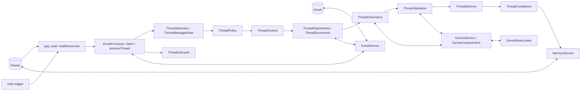
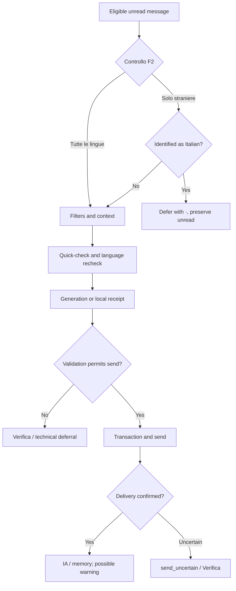

# Current system diagrams

Aligned with local source on 29 September 2026.

## Components

```mermaid
flowchart LR
 Sheets[(Sheets)] --> Main[gas_main: loadResources]
 Trigger[main trigger] --> Main
 Main --> Batch[EmailProcessor: batch / processThread]
 Gmail[(Gmail)] <--> Service[GmailService]
 Service <--> Batch
 Batch --> Select[ThreadSelection / ThreadMessageState]
 Select --> Policy[ThreadPolicy]
 Policy --> Context[ThreadContext]
 Context --> Attach[ThreadAttachments / ThreadDocuments]
 Attach --> Generate[ThreadGeneration]
 Generate --> Validate[ThreadValidation]
 Validate --> Deliver[ThreadDelivery]
 Deliver --> Complete[ThreadCompletion]
 Batch --> Lifecycle[ThreadLifecycle]
 Generate <--> Gemini[GeminiService / GeminiContentClient]
 Validate <--> Gemini
 Gemini <--> Limiter[GeminiRateLimiter]
 Complete --> Memory[MemoryService]
 Memory <--> Sheets
 Attach <--> Service
```

## Language and delivery

```mermaid
flowchart TD
 A[Eligible unread message] --> B{Controllo F2}
 B -->|Tutte le lingue| C[Filters and context]
 B -->|Solo straniere| D{Identified as Italian?}
 D -->|Yes| E[Defer with ·, preserve unread]
 D -->|No| C
 C --> Q[Quick-check and language recheck]
 Q --> G[Generation or local receipt]
 G --> V{Validation permits send?}
 V -->|No| R[Verifica / technical deferral]
 V -->|Yes| S[Transaction and send]
 S --> O{Delivery confirmed?}
 O -->|Yes| M[IA / memory; possible warning]
 O -->|Uncertain| U[send_uncertain / Verifica]
```

This is a summary: filters and quick-check can also finish without replying; crises and other guardrails can stop before generation. Dry-run stops before sending. Returning to all languages stops excluding otherwise eligible messages with ·.

[Contracts and responsibilities](ARCHITECTURE.md) · [Language modes](LANGUAGE_MODES.md)
