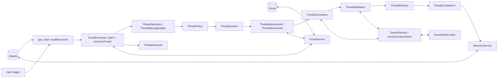
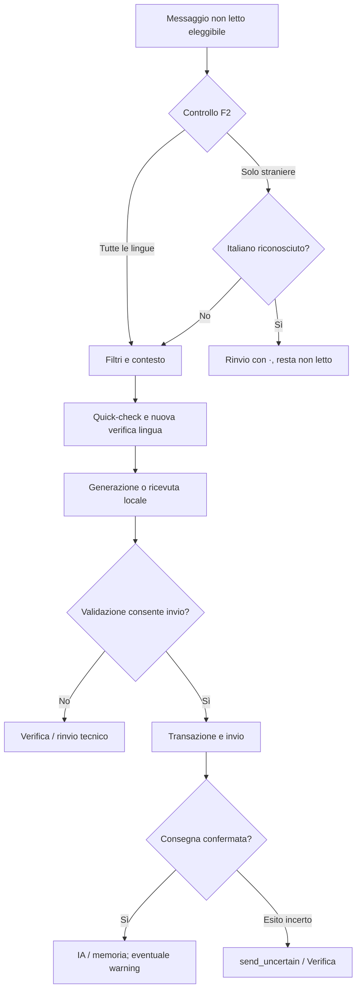

# Diagrammi del funzionamento attuale

Allineati al codice locale il 29 settembre 2026.

## Componenti

```mermaid
flowchart LR
 Sheets[(Sheets)] --> Main[gas_main: loadResources]
 Trigger[main trigger] --> Main
 Main --> Batch[EmailProcessor: batch / processThread]
 Gmail[(Gmail)] <--> Service[GmailService]
 Service <--> Batch
 Batch --> Select[ThreadSelection / ThreadMessageState]
 Select --> Policy[ThreadPolicy]
 Policy --> Context[ThreadContext]
 Context --> Attach[ThreadAttachments / ThreadDocuments]
 Attach --> Generate[ThreadGeneration]
 Generate --> Validate[ThreadValidation]
 Validate --> Deliver[ThreadDelivery]
 Deliver --> Complete[ThreadCompletion]
 Batch --> Lifecycle[ThreadLifecycle]
 Generate <--> Gemini[GeminiService / GeminiContentClient]
 Validate <--> Gemini
 Gemini <--> Limiter[GeminiRateLimiter]
 Complete --> Memory[MemoryService]
 Memory <--> Sheets
 Attach <--> Service
```

## Lingua e invio

```mermaid
flowchart TD
 A[Messaggio non letto eleggibile] --> B{Controllo F2}
 B -->|Tutte le lingue| C[Filtri e contesto]
 B -->|Solo straniere| D{Italiano riconosciuto?}
 D -->|Sì| E[Rinvio con ·, resta non letto]
 D -->|No| C
 C --> Q[Quick-check e nuova verifica lingua]
 Q --> G[Generazione o ricevuta locale]
 G --> V{Validazione consente invio?}
 V -->|No| R[Verifica / rinvio tecnico]
 V -->|Sì| S[Transazione e invio]
 S --> O{Consegna confermata?}
 O -->|Sì| M[IA / memoria; eventuale warning]
 O -->|Esito incerto| U[send_uncertain / Verifica]
```

Il diagramma riassume il percorso: filtri e quick-check possono anche chiudere senza risposta; crisi e altri guardrail possono fermarsi prima della generazione. In dry-run non si arriva all'invio. Tornando a Tutte le lingue, · non esclude più i messaggi ancora lavorabili.

[Contratti e responsabilità](ARCHITECTURE_IT.md) · [Modalità lingua](LANGUAGE_MODES_IT.md)
