# 📐 Diagrammi Architettura Sistema

> **Visualizzazione completa dell'architettura SPA (Segreteria Parrocchiale Automatica)**

---

## 1. Vista Componenti (C4 Level 2)

```mermaid
graph TB
    subgraph "Google Workspace"
        Gmail["📧 Gmail API"]
        Sheets["📊 Google Sheets"]
    end
    
    subgraph "Google Apps Script Runtime"
        Main["🎯 Main.gs<br/>Orchestrator"]
        Proc["⚙️ EmailProcessor<br/>Pipeline Manager"]
        Class["🧹 Classifier<br/>Filter Engine"]
        ReqClass["🎨 RequestClassifier<br/>Type Detector"]
        Gemini["🤖 GeminiService<br/>AI Gateway"]
        Valid["✅ ResponseValidator<br/>Quality Gate"]
        Memory["💾 MemoryService<br/>State Manager"]
        Rate["⏱️ RateLimiter<br/>Quota Manager"]
        Prompt["📝 PromptEngine<br/>Template Builder"]
        Territory["🗺️ TerritoryValidator<br/>Address Checker"]
    end
    
    subgraph "External APIs"
        GeminiAPI["🧠 Google Gemini API<br/>2.5 Flash / Lite"]
    end
    
    Gmail -->|Read Threads| Main
    Main -->|Schedule| Proc
    Proc --> Class
    Proc --> ReqClass
    Proc --> Territory
    ReqClass --> Prompt
    Prompt --> Gemini
    Gemini -->|Rate Check| Rate
    Rate -->|API Call| GeminiAPI
    GeminiAPI -->|Response| Gemini
    Gemini --> Valid
    Valid --> Memory
    Memory --> Sheets
    Valid -->|Send Reply| Gmail
```

---

## 2. Flusso Dati Email (Sequence Diagram)

```mermaid
sequenceDiagram
    participant U as 👤 Utente
    participant G as 📧 Gmail
    participant M as 🎯 Main
    participant P as ⚙️ Processor
    participant C as 🧹 Classifier
    participant AI as 🤖 Gemini
    participant V as ✅ Validator
    participant S as 💾 Memory
    
    U->>G: Invia Email
    Note over G: Email non letta in Inbox
    
    rect rgb(240, 248, 255)
        Note over M: Trigger ogni 5 minuti
        M->>G: Cerca email non lette
        G->>M: Lista thread
    end
    
    loop Per ogni thread
        M->>P: Processa thread
        
        P->>C: Classifica email
        C-->>P: shouldReply, category, lang
        
        alt Email da ignorare
            P->>G: Applica label "Skipped"
        else Email valida
            P->>AI: Quick Check
            AI-->>P: reply_needed, confidence
            
            alt Risposta necessaria
                P->>AI: Genera risposta
                AI-->>P: Risposta AI
                
                P->>V: Valida risposta
                
                alt Validazione OK (score ≥ 0.6)
                    V-->>P: ✅ Valid
                    P->>G: Invia risposta
                    P->>G: Applica label "IA"
                    P->>S: Aggiorna memoria
                else Validazione FAIL
                    V-->>P: ❌ Invalid
                    P->>G: Applica label "Verifica"
                end
            else Nessuna risposta necessaria
                P->>G: Applica label "NoReply"
            end
        end
    end
```

---

## 3. Pipeline di Validazione (7 Layer)

```mermaid
graph LR
    subgraph "Input"
        R["📝 Risposta AI"]
    end
    
    subgraph "Validation Layers"
        L1["1️⃣ Lunghezza<br/>25-3000 chars"]
        L2["2️⃣ Lingua<br/>IT/EN/ES"]
        L3["3️⃣ Firma<br/>Presente?"]
        L4["4️⃣ Contenuto<br/>Vietato?"]
        L5["5️⃣ Allucinazioni<br/>Dati inventati?"]
        L6["6️⃣ Grammatica<br/>Maiuscola post-virgola"]
        L7["7️⃣ Thinking Leak<br/>Ragionamento esposto?"]
    end
    
    subgraph "Output"
        OK["✅ VALID<br/>Invia"]
        FAIL["❌ INVALID<br/>Verifica"]
    end
    
    R --> L1 --> L2 --> L3 --> L4 --> L5 --> L6 --> L7
    L7 -->|score ≥ 0.6| OK
    L7 -->|score < 0.6| FAIL
```

---

## 4. Strategia Fallback Modelli AI

```mermaid
graph TD
    subgraph "Task Type"
        QC["🔍 Quick Check"]
        GEN["📝 Generation"]
        FB["🔄 Fallback"]
    end
    
    subgraph "Model Chain"
        F25["⭐ Flash 2.5<br/>RPD: 250"]
        FLITE["💡 Flash Lite<br/>RPD: 1000"]
        F20["📦 Flash 2.0<br/>RPD: 100"]
    end
    
    subgraph "Decision"
        CHECK{Quota OK?}
        NEXT[Prova prossimo]
        ERROR["🚨 QUOTA_EXHAUSTED"]
    end
    
    QC --> FLITE
    GEN --> F25
    FB --> FLITE
    
    F25 --> CHECK
    FLITE --> CHECK
    F20 --> CHECK
    
    CHECK -->|SÌ| USE["✅ Usa questo modello"]
    CHECK -->|NO| NEXT
    NEXT --> F20
    F20 -->|Esaurito| ERROR
```

---

## 5. Gestione Memoria Conversazionale

---

## 6. Sistema Rate Limiting

```mermaid
graph TB
    subgraph "Metriche Tracciate"
        RPM["⏱️ RPM<br/>Requests/Minute"]
        TPM["📊 TPM<br/>Tokens/Minute"]
        RPD["📅 RPD<br/>Requests/Day"]
    end
    
    subgraph "Controlli"
        C1{RPM < Limite?}
        C2{TPM < Limite?}
        C3{RPD < Limite?}
        SAFETY{RPD > 80%?}
    end
    
    subgraph "Azioni"
        OK["✅ Procedi"]
        WAIT["⏳ Attendi 60s"]
        FALLBACK["🔄 Fallback Model"]
        VALVE["🚨 Safety Valve<br/>Riduci carico 50%"]
        BLOCK["🛑 QUOTA_EXHAUSTED"]
    end
    
    RPM --> C1
    TPM --> C2
    RPD --> C3
    
    C1 -->|SÌ| C2
    C1 -->|NO| WAIT
    
    C2 -->|SÌ| C3
    C2 -->|NO| WAIT
    
    C3 -->|SÌ| SAFETY
    C3 -->|NO| FALLBACK
    
    SAFETY -->|SÌ| VALVE
    SAFETY -->|NO| OK
    
    FALLBACK -->|Nessun modello| BLOCK
```

---

## 7. Prompt Construction Pipeline

```mermaid
graph LR
    subgraph "Context Gathering"
        A1["📧 Email Content"]
        A2["💬 Thread History"]
        A3["💾 Memory"]
        A4["🗺️ Territory"]
        A5["📅 Temporal"]
    end
    
    subgraph "Profile Selection"
        P1["🪶 Lite<br/>< 50k tokens"]
        P2["📦 Standard<br/>50-80k tokens"]
        P3["🏋️ Heavy<br/>80-100k tokens"]
    end
    
    subgraph "Template Composition"
        T["18 Template Modulari"]
    end
    
    subgraph "Optimization"
        O1["Token Counting"]
        O2["KB Truncation"]
        O3["Example Removal"]
    end
    
    subgraph "Output"
        FINAL["📝 Final Prompt<br/>< 100k tokens"]
    end
    
    A1 & A2 & A3 & A4 & A5 --> P1 & P2 & P3
    P1 & P2 & P3 --> T
    T --> O1 --> O2 --> O3 --> FINAL
```

---

## 8. Architettura Fogli Google Sheets

---

## 9. Flusso Decisione Tipo Richiesta

```mermaid
graph TD
    subgraph "Input Analysis"
        IN["📧 Email Ricevuta"]
        REG["🔍 Regex Scoring"]
        GEM["🤖 Gemini Quick Check"]
    end
    
    subgraph "Classification"
        TECH["🔧 TECHNICAL<br/>Orari, documenti, procedure"]
        PAST["💜 PASTORAL<br/>Supporto spirituale"]
        DOCT["📖 DOCTRINAL<br/>Teologia, catechismo"]
        MIX["🎨 MIXED<br/>Entrambi aspetti"]
        SIMP["📋 SIMPLE<br/>Segreteria base"]
    end
    
    subgraph "KB Loading"
        LITE["🪶 LITE<br/>Solo Istruzioni"]
        STD["📦 STANDARD<br/>+ AI_CORE_LITE"]
        HEAVY["🏋️ HEAVY<br/>+ AI_CORE + Dottrina"]
    end
    
    IN --> REG & GEM
    REG --> |Confidence < 0.75| SCORE["Score Keywords"]
    GEM --> |Confidence ≥ 0.75| DIRECT["Usa Categoria Gemini"]
    
    SCORE --> TECH & PAST & DOCT & MIX & SIMP
    DIRECT --> TECH & PAST & DOCT & MIX & SIMP
    
    TECH --> STD
    PAST --> HEAVY
    DOCT --> HEAVY
    MIX --> HEAVY
    SIMP --> LITE
```

---

## 📚 Legenda

| Simbolo | Significato |
|---------|-------------|
| 🎯 | Entry Point / Orchestrator |
| ⚙️ | Componente di elaborazione |
| 🤖 | Servizio AI |
| ✅ | Validazione |
| 💾 | Storage / Memoria |
| 📧 | Email / Gmail |
| 🗺️ | Territorio |
| ⏱️ | Rate Limiting |
| 📝 | Prompt / Template |

---

**[English Version](ARCHITECTURE_DIAGRAMS.md)** | **[Architettura Dettagliata](ARCHITECTURE_IT.md)** | **[Torna a README](../README_IT.md)**
