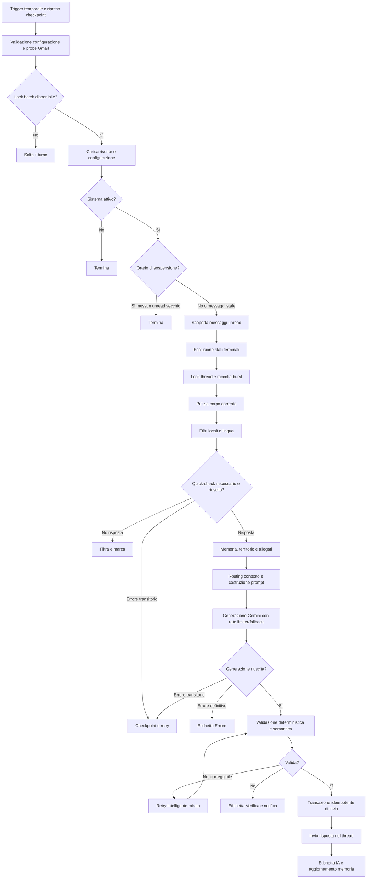
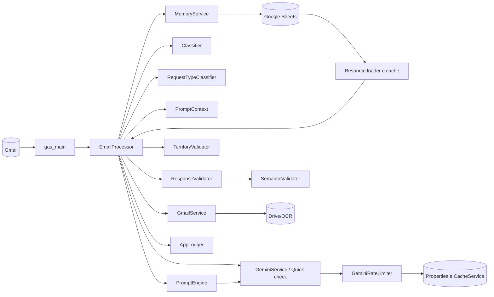

# Documento di progetto — Segreteria Parrocchiale Automatica

## Sistema intelligente di gestione della posta elettronica parrocchiale

| Voce | Valore |
|---|---|
| Tipo di documento | Documento di progetto ricostruito sul sistema realizzato (*as built*) |
| Stato | Baseline del sistema in esercizio |
| Data di riferimento | 28 agosto 2026 |
| Revisione software di riferimento | `65f70ca` |
| Piattaforma | Google Apps Script V8, Gmail, Google Sheets, Google Drive, Gemini API |
| Ambienti di esercizio | Parrocchia; donRaimondo |
| Lingua del documento | Italiano |

> Questo documento descrive il progetto che avrebbe dovuto precedere e guidare la realizzazione del sistema oggi presente. È stato ricostruito dal comportamento effettivo, dal codice, dai test e dalle procedure operative. Le informazioni gestionali contenute nei Fogli Google — orari, contatti, procedure, territorio, dottrina e istruzioni pastorali — restano dati configurabili e non sono replicate qui.

---

## 1. Sintesi esecutiva

La Segreteria Parrocchiale Automatica è un sistema di supporto alla gestione delle email ricevute da una parrocchia. Il suo scopo non è sostituire la segreteria o il sacerdote, ma automatizzare in sicurezza le risposte che possono essere fondate sulle informazioni approvate dalla parrocchia, riconoscendo e demandando a una persona i casi incerti, sensibili o non sufficientemente documentati.

Il sistema:

- individua i nuovi messaggi non letti a livello di singolo messaggio Gmail;
- elimina dal corpo firme e citazioni delle email precedenti;
- filtra newsletter, notifiche automatiche, risposte fuori sede, mittenti esclusi e messaggi che non richiedono risposta;
- comprende lingua, intento, richiesta concreta, vincoli e tono relazionale;
- consulta una Knowledge Base amministrata tramite Google Sheets;
- mantiene una memoria sintetica del thread per evitare ripetizioni e preservare la continuità;
- analizza, quando necessario, allegati PDF, immagini e documenti Office;
- verifica indirizzi e numeri civici rispetto al territorio parrocchiale;
- genera una risposta con Gemini usando un contesto modulare e proporzionato al caso;
- sottopone la risposta a controlli deterministici e semantici;
- tenta una sola correzione mirata quando l'errore è correggibile;
- invia soltanto una risposta considerata sufficientemente fondata e sicura;
- applica etichette Gmail per rendere visibile l'esito operativo;
- conserva checkpoint e riprova in seguito in caso di indisponibilità temporanee.

Il principio guida è:

> Automatizzare ciò che è supportato; non inventare ciò che manca; non perdere i messaggi; rendere evidente quando serve una decisione umana.

---

## 2. Contesto e problema da risolvere

### 2.1 Situazione iniziale

Una segreteria parrocchiale riceve richieste molto eterogenee:

- orari, celebrazioni, appuntamenti e contatti;
- certificati e pratiche amministrative;
- iscrizioni a catechesi e percorsi sacramentali;
- invio di moduli e documenti;
- verifica dell'appartenenza territoriale;
- richieste pastorali o dottrinali;
- conversazioni successive a una risposta già data;
- messaggi in lingue diverse dall'italiano;
- comunicazioni automatiche, pubblicitarie o prive di una domanda reale.

La risposta manuale comporta lavoro ripetitivo, tempi variabili e il rischio di incoerenza tra operatori. Una semplice risposta generativa, tuttavia, introdurrebbe rischi più gravi: procedure inventate, date o orari inesistenti, interpretazione errata degli allegati, risposte burocratiche a bisogni relazionali e automazioni duplicate.

### 2.2 Problema progettuale

Il problema non è soltanto “scrivere una buona email”, ma decidere in modo affidabile:

1. se il messaggio debba essere elaborato;
2. quale sia il bisogno reale del mittente;
3. quali fonti siano autorizzate;
4. quali informazioni siano pertinenti;
5. se vi siano documenti da leggere o verificare;
6. quale tono sia appropriato;
7. se la risposta prodotta possa essere inviata automaticamente;
8. come evitare doppie risposte, loop e perdita del lavoro in caso di timeout o quota.

### 2.3 Opportunità

Google Workspace offre nello stesso ambiente posta, script serverless, fogli di configurazione, storage documentale, trigger temporali e autorizzazioni centralizzate. Gemini aggiunge comprensione linguistica e generazione, mentre regole locali, validatori e stato persistente forniscono i necessari limiti operativi.

---

## 3. Visione del prodotto

### 3.1 Visione

Realizzare un assistente email parrocchiale controllabile, osservabile e prudente, capace di rispondere automaticamente alle richieste supportate dalle fonti ufficiali della parrocchia e di trasferire alla revisione umana tutto ciò che non può essere risolto con sufficiente affidabilità.

### 3.2 Obiettivi

| ID | Obiettivo |
|---|---|
| O-01 | Ridurre il lavoro ripetitivo della segreteria sulle richieste ricorrenti. |
| O-02 | Fornire risposte coerenti con la Knowledge Base approvata. |
| O-03 | Conservare un tono professionale, umano e adeguato alla natura pastorale del servizio. |
| O-04 | Gestire correttamente thread, follow-up, firme, citazioni e messaggi multipli ravvicinati. |
| O-05 | Evitare invii duplicati e loop tra risposte automatiche. |
| O-06 | Individuare allucinazioni, contraddizioni, informazioni non supportate e procedure inventate. |
| O-07 | Rendere configurabile il comportamento ordinario senza modificare il codice. |
| O-08 | Continuare a operare entro i limiti di tempo e quota di Google Apps Script e Gemini. |
| O-09 | Rendere immediatamente visibili i casi inviati, ignorati, falliti o da verificare. |
| O-10 | Supportare due installazioni GAS mantenute dallo stesso codice sorgente. |

### 3.3 Non-obiettivi

Il sistema non deve:

- sostituire il discernimento pastorale o una decisione del sacerdote;
- assumere valore canonico, legale o certificativo;
- modificare autonomamente registri parrocchiali o sacramentali;
- attestare l'esistenza o la correttezza di un documento prima della verifica;
- inventare procedure per colmare lacune della KB;
- dedurre indisponibilità, divieti o eccezioni non esplicitamente presenti nelle fonti;
- inviare allegati generati autonomamente;
- cancellare email ricevute;
- rispondere a newsletter, notifiche di sistema o indirizzi automatici;
- usare la memoria conversazionale come fonte autorevole per dati operativi mutabili.

---

## 4. Stakeholder e responsabilità

| Ruolo | Responsabilità |
|---|---|
| Parroco o responsabile pastorale | Approva principi pastorali, dottrina, casi da demandare e limiti dell'automazione. |
| Segreteria parrocchiale | Mantiene procedure, orari, contatti e modelli informativi nella KB; gestisce i casi in `Verifica` ed `Errore`. |
| Amministratore del sistema | Configura account, proprietà, trigger, autorizzazioni, quote, deploy e monitoraggio. |
| Responsabile privacy | Valuta base giuridica, informativa, conservazione, uso del provider AI e accessi ai dati. |
| Manutentore software | Corregge difetti, mantiene test, documentazione e compatibilità delle API. |
| Mittente | Riceve la risposta e conserva sempre la possibilità di interagire con una persona. |

### 4.1 Matrice sintetica RACI

| Attività | Parroco | Segreteria | Admin | Manutentore |
|---|---:|---:|---:|---:|
| Approvare contenuti pastorali/dottrinali | A/R | C | I | I |
| Aggiornare informazioni operative | C | A/R | I | I |
| Gestire `Verifica` ed `Errore` | C | A/R | C | I |
| Configurare credenziali e trigger | I | C | A/R | C |
| Pubblicare il codice | I | I | A | R |
| Correggere regressioni | I | C | C | A/R |
| Valutare privacy e conservazione | A | C | R | C |

Legenda: R = responsabile operativo; A = responsabile finale; C = consultato; I = informato.

---

## 5. Principi di progettazione

### 5.1 Grounding prima della generazione

Le informazioni operative devono provenire dalla KB, dal messaggio corrente, dagli allegati effettivamente disponibili o da risultati deterministici del sistema. Gemini non è una fonte autonoma di procedure parrocchiali.

Conseguenze:

- un fatto non presente non può essere trasformato in una negazione certa;
- una procedura plausibile ma non documentata deve essere omessa;
- in presenza di una lacuna si comunica soltanto il prossimo passo autorizzato;
- la prudenza non deve diventare un limite inventato.

### 5.2 Pertinenza prima della completezza

Una voce della KB può contenere più informazioni vere, ma la risposta deve includere soltanto quelle che risolvono il bisogno concreto, i vincoli o le domande del mittente.

### 5.3 Comprensione dell'intento prima del riconoscimento delle parole

Parole come “modulo”, “certificato” o “allegato” non determinano da sole il flusso. Il sistema deve distinguere tra:

- richiesta di informazioni;
- richiesta operativa;
- consegna di un documento;
- domanda che accompagna una consegna;
- correzione di dati già comunicati;
- semplice ringraziamento;
- follow-up che modifica il contesto precedente.

### 5.4 Difesa in profondità

La sicurezza della risposta non è affidata a un unico prompt. È ottenuta attraverso:

1. pulizia dell'input;
2. filtri locali;
3. classificazione e quick-check;
4. contesto selettivo;
5. istruzioni di generazione;
6. validazione deterministica;
7. validazione semantica;
8. retry correttivo mirato;
9. revisione umana;
10. idempotenza dell'invio.

### 5.5 Fallimento esplicito e recuperabile

Un errore transitorio non deve diventare una decisione permanente. Errori di rete, `429`, `503`, scadenza del tempo o indisponibilità temporanea devono produrre un rinvio con checkpoint, non un'etichetta terminale che impedisca il recupero.

### 5.6 Configurazione separata dal codice

Contenuti e impostazioni ordinarie devono essere mantenuti nei Fogli o nelle Script Properties. Il codice contiene meccanismi, invarianti e controlli; la KB contiene ciò che la parrocchia sa e autorizza a comunicare.

### 5.7 Automazione osservabile

Ogni esecuzione deve rendere leggibili almeno:

- thread e messaggio in lavorazione;
- fase raggiunta;
- classificazione e routing principali;
- modello selezionato e tentativi;
- esito della validazione;
- motivo di invio, filtro, rinvio o revisione;
- stato del checkpoint e delle etichette.

---

## 6. Ambito funzionale

### 6.1 Acquisizione e selezione dei messaggi

| ID | Requisito |
|---|---|
| RF-001 | Il sistema deve cercare messaggi `INBOX` e `UNREAD` a livello di singolo messaggio. |
| RF-002 | Deve poter usare una modalità metadata come percorso principale e una query Gmail come fallback. |
| RF-003 | Deve elaborare i thread in ordine FIFO per ridurre l'attesa dei messaggi più vecchi. |
| RF-004 | Deve ignorare i messaggi già associati a uno stato terminale. |
| RF-005 | Deve riconoscere account, alias e indirizzi equivalenti Gmail/Googlemail come identità interne. |
| RF-006 | Deve saltare un thread se l'ultimo messaggio utile proviene dalla segreteria e non vi sono nuovi messaggi esterni. |
| RF-007 | Deve accorpare i messaggi esterni ravvicinati dello stesso thread quando costituiscono un unico burst conversazionale. |
| RF-008 | Deve limitare l'elaborazione per mittente in caso di burst simultanei su thread diversi. |

### 6.2 Pulizia del contenuto

| ID | Requisito |
|---|---|
| RF-010 | Il corpo corrente deve essere separato dalle citazioni precedenti prima della classificazione. |
| RF-011 | Devono essere riconosciuti i marcatori testuali Gmail, Outlook e client mobili. |
| RF-012 | Devono essere riconosciute le strutture HTML `gmail_quote`, `gmail_attr`, `blockquote type=cite` e `divRplyFwdMsg`. |
| RF-013 | Le firme su riga autonoma, comprese “Cordiali saluti” e “Cordialmente”, devono delimitare il testo corrente senza troncare frasi ordinarie. |
| RF-014 | Una singola riga simile a un header, per esempio “Da: Roma”, non deve essere scambiata per una citazione. |
| RF-015 | Il testo HTML deve essere convertito in plain text conservando i link utili e neutralizzando markup pericoloso. |

### 6.3 Filtri e decisione di risposta

| ID | Requisito |
|---|---|
| RF-020 | Il sistema deve filtrare newsletter, marketing, notifiche automatiche, no-reply e out-of-office. |
| RF-021 | Domini, indirizzi e parole da ignorare devono essere estendibili dal foglio `Controllo`. |
| RF-022 | Un ringraziamento o una conferma puramente conclusiva può essere filtrato soltanto quando non contiene nuovi dati o domande. |
| RF-023 | Una domanda esplicita deve prevalere sulla classificazione “gratitude”. |
| RF-024 | La modalità `foreign_only` deve ignorare in sicurezza i messaggi italiani e contrassegnarli con l'etichetta di skip. |
| RF-025 | Se il quick-check AI fallisce per errore transitorio, la pipeline deve interrompersi senza prendere una decisione sostitutiva rischiosa. |

### 6.4 Comprensione della richiesta

| ID | Requisito |
|---|---|
| RF-030 | Deve essere rilevata la lingua tra almeno italiano, inglese, spagnolo, portoghese, francese e tedesco. |
| RF-031 | Devono essere distinti categoria, topic, scopo operativo, postura relazionale e strategia di risposta. |
| RF-032 | Devono essere rilevati i vincoli dichiarati: tempo, mobilità, lavoro, presenza fisica, urgenza e scadenze sacramentali. |
| RF-033 | Deve essere riconosciuta una richiesta informativa, operativa, documentale, pastorale, dottrinale, territoriale o mista. |
| RF-034 | Una scadenza deve essere trattata come vincolo della richiesta anche quando non riguarda il ruolo di padrino o madrina. |
| RF-035 | Il sistema deve riconoscere quando un follow-up corregge, integra o contesta informazioni precedenti. |
| RF-036 | L'assenza di una regola nella KB non deve essere interpretata come prova di indisponibilità. |

### 6.5 Knowledge Base e contenuti

| ID | Requisito |
|---|---|
| RF-040 | Il foglio `Istruzioni` deve essere sempre disponibile come fonte operativa principale. |
| RF-041 | `AI_CORE_LITE`, `AI_CORE` e `Dottrina` devono essere inclusi selettivamente in base al caso. |
| RF-042 | Il sistema deve produrre un report di salute per righe incomplete, colonne richieste mancanti e duplicati categoria/informazione. |
| RF-043 | Una modifica utente ai fogli di risorsa deve invalidare la cache senza essere attivata dalle scritture della memoria o delle metriche. |
| RF-044 | La KB completa deve essere conservata in cache; gli eventuali tagli devono avvenire soltanto nella costruzione del prompt. |
| RF-045 | Le sostituzioni redazionali devono essere gestibili nel foglio `Sostituzioni`. |
| RF-046 | Se la KB non è disponibile, il batch deve interrompersi invece di rispondere senza fondamento. |

### 6.6 Memoria conversazionale

| ID | Requisito |
|---|---|
| RF-050 | Per ogni thread deve poter essere conservata una sintesi, non la trascrizione completa come memoria permanente. |
| RF-051 | Devono essere ricordati lingua, categoria, tono, argomenti già comunicati, conteggio messaggi e flag contestuali. |
| RF-052 | La memoria deve impedire la ripetizione meccanica di informazioni già fornite. |
| RF-053 | I dati sensibili precedenti non devono essere riaperti se il mittente non li riprende nel messaggio corrente. |
| RF-054 | Gli aggiornamenti devono usare lock granulari e versione ottimistica per evitare sovrascritture concorrenti. |
| RF-055 | Un errore della memoria successivo all'invio non deve trasformare una risposta già spedita in un nuovo invio. |
| RF-056 | Deve essere prevista una pulizia periodica delle memorie obsolete. |

### 6.7 Allegati e documenti

| ID | Requisito |
|---|---|
| RF-060 | Devono essere individuati allegati fisici, testo compilato nel corpo e annunci di consegna. |
| RF-061 | Il sistema deve distinguere gli stati `none`, `received_body`, `received_attachment`, `missing`, `unannounced_attachment`, `incongruent` e `unverified_attachment`. |
| RF-062 | Il quick-check AI può confermare un'aspettativa documentale, ma non può creare da solo lo stato negativo “documento mancante”. |
| RF-063 | La frase “in allegato” in un messaggio storico citato non deve contaminare il messaggio corrente. |
| RF-064 | Una consegna documentale senza domande può ricevere una conferma sintetica. |
| RF-065 | La presenza di una domanda o di un desiderio operativo deve impedire il percorso rigido di sola ricevuta. |
| RF-066 | Se un allegato sembra incoerente, la risposta deve usare una formula prudente e chiedere di verificare/reinviare il file corretto, rispondendo comunque alle domande autonome. |
| RF-067 | Se un documento annunciato manca davvero, la risposta non deve confermarne la ricezione. |
| RF-068 | L'OCR deve essere attivato in base a presenza allegati, contenuto, parole chiave e budget disponibile. |
| RF-069 | I file temporanei creati per conversione/OCR devono essere eliminati o inseriti in una coda persistente di pulizia. |

### 6.8 Controllo territoriale

| ID | Requisito |
|---|---|
| RF-070 | Deve essere possibile estrarre uno o più indirizzi dal messaggio. |
| RF-071 | Vie equivalenti e abbreviazioni devono essere normalizzate senza confondere strade diverse. |
| RF-072 | Devono essere supportati range civici, parità, suffissi e civici non determinati. |
| RF-073 | La risposta non deve contraddire l'esito deterministico del validatore territoriale. |
| RF-074 | Il controllo territoriale deve essere eseguito quando richiesto o quando la richiesta implica appartenenza parrocchiale, non su ogni email. |

### 6.9 Generazione della risposta

| ID | Requisito |
|---|---|
| RF-080 | La risposta deve essere generata nella lingua del mittente. |
| RF-081 | Il saluto deve dipendere dall'ora corrente di Roma, non dalla data storica del messaggio. |
| RF-082 | Il livello di apertura e firma deve adattarsi a primo messaggio, follow-up e continuità ravvicinata. |
| RF-083 | Il prompt deve separare istruzioni di sistema, fonti, email corrente, storico, memoria, allegati e risultati deterministici. |
| RF-084 | Il profilo del prompt deve poter essere `lite`, `standard` o `heavy`. |
| RF-085 | I moduli pastorali e dottrinali non devono modificare procedure, date o requisiti della KB. |
| RF-086 | Quando la KB autorizza una flessibilità o personalizzazione, la risposta non deve restringerla con limiti inventati. |
| RF-087 | La risposta deve affrontare il bisogno concreto prima delle informazioni accessorie. |
| RF-088 | Un vincolo temporale deve ricevere una risposta prudente: distinguere la fattibilità del percorso dalla data effettiva dell'evento o sacramento. |
| RF-089 | Il testo destinato all'utente deve essere isolato dal ragionamento interno mediante un contratto di output esplicito. |

### 6.10 Validazione e correzione

| ID | Requisito |
|---|---|
| RF-090 | Prima dell'invio devono essere verificati lunghezza, lingua, firma, contenuti vietati e placeholder. |
| RF-091 | Devono essere bloccati orari, date, telefoni, email e procedure non supportati dalle fonti autorizzate. |
| RF-092 | Deve essere rilevato il ragionamento interno esposto all'utente. |
| RF-093 | Devono essere controllate coerenza temporale, riferimenti papali correnti e qualificazione di “oggi/domani”. |
| RF-094 | Devono essere controllati presenza fisica, territorio, continuità sensibile e template documentali. |
| RF-095 | I rischi di trasferimento indiscriminato della KB devono attivare la validazione semantica anche con punteggio formale alto. |
| RF-096 | Un retry intelligente deve ricevere gli errori della prima validazione e le fonti originali, senza perdere il grounding. |
| RF-097 | Il retry semantico deve essere limitato per non moltiplicare costi, latenza e rischio. |
| RF-098 | Una risposta ancora non valida dopo il retry non deve essere inviata. |

### 6.11 Invio, etichette e revisione

| ID | Requisito |
|---|---|
| RF-100 | L'invio deve preservare il threading RFC tramite `In-Reply-To` e `References` quando disponibili. |
| RF-101 | L'oggetto non deve duplicare prefissi localizzati equivalenti a `Re:`. |
| RF-102 | Una transazione di idempotenza deve impedire due invii per lo stesso messaggio. |
| RF-103 | Dopo l'invio riuscito deve essere applicata l'etichetta `IA`. |
| RF-104 | Una risposta bloccata dalla validazione deve ricevere `Verifica` e una notifica all'operatore. |
| RF-105 | Una risposta valida ma con warning sotto la soglia prevista può essere inviata e marcata anche per controllo successivo. |
| RF-106 | Un errore tecnico definitivo deve ricevere `Errore`. |
| RF-107 | Un errore tecnico transitorio non deve ricevere etichette terminali; deve essere riprogrammato. |
| RF-108 | In `DRY_RUN` non devono avvenire invii, etichettature o notifiche operative. |

---

## 7. Flusso operativo end-to-end

### 7.1 Stati del messaggio

| Stato interno | Significato | Esito Gmail |
|---|---|---|
| `replied` | Risposta inviata con successo | `IA`; eventualmente `Verifica` per warning |
| `validation_failed` | Risposta non sufficientemente sicura | `Verifica`, nessun invio |
| `error` non retryable | Errore permanente o configurazione/API non recuperabile | `Errore` |
| `error` retryable | Rete, quota temporanea, `5xx` o servizio indisponibile | Nessuna label terminale; checkpoint |
| `filtered` | Messaggio riconosciuto come non meritevole di risposta | Marcatura secondo la policy applicata |
| `skipped` | Già gestito, lock non disponibile, nessun unread utile o altra condizione neutra | Nessun nuovo invio |
| `dilata` | Elaborazione rinviata per burst, deadline o budget | Checkpoint con `notBefore` |
| `dry_run` | Simulazione completa senza effetti esterni | Nessun invio/label operativa |

### 7.2 Semantica delle etichette

| Etichetta | Significato operativo |
|---|---|
| `IA` | Il messaggio è stato trattato e la risposta è stata inviata. |
| `Verifica` | Serve controllo umano. Normalmente la risposta non è stata inviata perché bloccata; può anche accompagnare un invio già effettuato se restano warning non bloccanti sotto la soglia configurata. |
| `Errore` | Il processo non può completarsi automaticamente per una causa tecnica definitiva o di configurazione. |
| `·` | Messaggio saltato in modalità “Solo straniere”. |

Le etichette devono essere applicate a livello di messaggio quando possibile, così un nuovo follow-up nello stesso thread resta elaborabile.

---

## 8. Architettura logica

### 8.1 Moduli e responsabilità

| Modulo | Responsabilità principale |
|---|---|
| `gas_main.js` | Entrypoint, trigger, lock globale, caricamento risorse, sospensioni, checkpoint, metriche. |
| `gas_config.js` | Parametri, modelli, soglie, proprietà sicure e validazione configurazione. |
| `gas_email_processor.js` | Orchestrazione completa del singolo thread e del batch; policy di dominio e stato. |
| `gas_gmail_service.js` | Discovery, metadata, label, parsing messaggi, allegati, invio MIME/threaded e contatori Gmail. |
| `gas_classifier.js` | Filtri locali, estrazione contenuto principale, segnali iniziali. |
| `gas_gemini_service.js` | Client Gemini, quick-check, task AI, parsing JSON e generazione. |
| `gas_request_classifier.js` | Classificazione multidimensionale della richiesta. |
| `gas_prompt_context.js` | Profilo, registro, concern e sintesi del contesto. |
| `gas_prompt_engine.js` | Composizione modulare del prompt e budgeting. |
| `gas_response_validator.js` | Validazione deterministica, qualitativa e semantica. |
| `gas_response_strategy.js` | Mappatura della postura relazionale in strategia di risposta. |
| `gas_memory_service.js` | Memoria thread, versionamento, lock granulari e pulizia. |
| `gas_rate_limiter.js` | Quote RPM/TPM/RPD, prenotazioni, persistenza e selezione modello. |
| `gas_territory_validator.js` | Normalizzazione indirizzi e verifica civici/range. |
| `gas_error_types.js` | Classificazione uniforme degli errori e retryability. |
| `gas_logger.js` | Log strutturato e notifiche amministrative. |
| `gas_setup_ui.js` | Creazione e validazione dell'interfaccia di configurazione su Sheets. |
| `gas_unit_tests.js` | Suite unitaria compatibile con GAS/Node. |

### 8.2 Dipendenze esterne

| Servizio | Uso | Modalità di fallimento attesa |
|---|---|---|
| Gmail API v1 | Discovery message-level, metadata, label, invio | Fail closed su identità/label; retry su errori transitori |
| GmailApp | Thread, messaggi, alias e fallback invio | Fallback controllato |
| Google Sheets | KB, controllo, memoria e metriche | Retry; stop se manca la KB |
| Google Drive API v3 | Conversione e OCR temporaneo | Allegato non verificabile; cleanup persistente |
| Gemini API | Quick-check, generazione, semantica | Rate limit, backoff, fallback modello/chiave e checkpoint |
| CacheService | Risorse, lock granulari e contatori veloci | Fallback persistente quando previsto |
| PropertiesService | Segreti, checkpoint, rate limiter, idempotenza | Fail safe sulle transazioni critiche |
| LockService | Serializzazione batch e scritture | Skip/rinvio, mai esecuzione concorrente non protetta |
| ScriptApp | Trigger periodici e di ripresa | Preservazione dei trigger esistenti se la creazione fallisce |

---

## 9. Modello dati e configurazione

### 9.1 Fogli Google

| Foglio | Struttura/uso |
|---|---|
| `Istruzioni` | `Categoria`, `Informazione`, `Dettagli`; fonte operativa sempre disponibile. |
| `AI_CORE_LITE` | Principi essenziali di stile, attenzione pastorale e comportamento. |
| `AI_CORE` | Indicazioni pastorali estese per casi complessi o longitudinali. |
| `Dottrina` | Contenuti dottrinali strutturati e testo di compatibilità. |
| `Sostituzioni` | Coppie `Originale` → `Sostituzione` per normalizzazioni redazionali. |
| `ConversationMemory` | Stato sintetico dei thread. |
| `Controllo` | Accensione, modalità lingua, assenze, fasce di sospensione, esclusioni e destinatario review. |
| `DailyMetrics` | Esportazione opzionale dei consumi per modello. |

### 9.2 ConversationMemory

| Colonna | Campo | Contenuto |
|---:|---|---|
| A | `threadId` | Identificatore Gmail del thread |
| B | `language` | Lingua prevalente |
| C | `category` | Categoria conversazionale |
| D | `tone` | Tono/registro |
| E | `providedInfo` | Elenco JSON degli argomenti già comunicati |
| F | `lastUpdated` | Ultimo aggiornamento |
| G | `messageCount` | Conteggio dei messaggi elaborati |
| H | `version` | Versione per concorrenza ottimistica |
| I | `memorySummary` | Sintesi breve del thread |
| J | `contextualFlags` | Flag JSON di continuità e sensibilità |

### 9.3 Script Properties

Proprietà minime o operative:

- `GEMINI_API_KEY`;
- eventuale chiave Gemini di riserva prevista dalla configurazione;
- `SPREADSHEET_ID`;
- `BOT_EMAIL`;
- `KNOWN_ALIASES`;
- `ADMIN_EMAIL`;
- `VALIDATION_REVIEW_EMAIL`;
- `METRICS_SHEET_ID` opzionale.

Proprietà gestite internamente includono checkpoint del batch, timestamp di modifica della KB, contatori e stato delle transazioni di invio. Non devono essere modificate manualmente senza una procedura di recovery.

### 9.4 Cache

La cache delle risorse ha TTL nominale di sei ore ed è serializzata integralmente. Se il payload supera il limite per singola entry, viene suddiviso in più parti. La lettura deve rifiutare payload multipart incompleti senza cancellare dati validi scritti da un'altra esecuzione.

L'invalidazione immediata è provocata da modifiche utente ai fogli di risorsa o ai range configurativi rilevanti. Le scritture della memoria non devono invalidare la KB.

### 9.5 Configurazione operativa di riferimento

| Parametro | Baseline |
|---|---:|
| Email massime per esecuzione | 2 |
| Budget massimo esecuzione | 280 secondi |
| Margine minimo prima di nuove fasi AI | 90 secondi |
| Cronologia massima nel thread | 8 messaggi |
| Soglia validazione | 0,60 |
| Soglia warning/review | 0,90 |
| TTL cache etichette Gmail | 6 ore |
| TTL checkpoint | 10 minuti |
| Riprese rapide dello stesso checkpoint | massimo 3 |
| Modello qualità | Gemini 3.7 Flash |
| Modello task rapidi | Gemini 3.5 Flash-Lite |

Le quote indicate nel codice sono limiti locali di protezione e devono essere allineate periodicamente con quelle effettive del progetto Google.

---

## 10. Architettura AI e prompting

### 10.1 Task AI separati

Il sistema usa Gemini per compiti differenti, con profili e modelli distinti:

| Task | Scopo | Strategia primaria |
|---|---|---|
| `quick_check` | Necessità di risposta, lingua, intento, segnali documentali e relazionali | Flash-Lite |
| `classification` | Classificazioni ausiliarie | Flash-Lite |
| `language` | Rilevamento AI di riserva | Flash-Lite |
| `semantic` | Controllo semantico della risposta | Flash-Lite |
| `newsletter_summary` | Supporto ai filtri | Flash-Lite |
| `generation` | Risposta finale di qualità | Flash, poi fallback controllati |

### 10.2 Contesto della generazione

Il prompt finale può contenere:

- identità e ruolo della segreteria;
- data e ora correnti in Europa/Roma;
- lingua, saluto e firma richiesti;
- email corrente già ripulita;
- oggetto e metadati pertinenti;
- storico limitato del thread;
- memoria sintetica e informazioni già fornite;
- KB operativa;
- moduli pastorali/dottrinali selezionati;
- testo o rappresentazione multimodale degli allegati;
- risultato territoriale;
- modello di consegna documentale;
- vincoli fisici e temporali;
- strategia di risposta e concern attivi;
- contratto di output che separa analisi e testo dell'email.

### 10.3 Routing del contesto

| Profilo | Uso |
|---|---|
| `lite` | Richieste tecniche semplici, con riduzione dei moduli non pertinenti. |
| `standard` | Richieste ordinarie che richiedono contesto operativo e qualità completa. |
| `heavy` | Casi pastorali, dottrinali, sensibili, longitudinali o formalmente complessi. |

Il routing deve ridurre il rumore, non eliminare fonti necessarie. La KB operativa resta prioritaria; dottrina e pastorale non possono derogarla.

### 10.4 Budget del prompt

Il sistema deve:

- stimare localmente i token senza chiamare `/countTokens`;
- riservare spazio alle istruzioni e alla risposta;
- limitare storico, memoria e allegati;
- selezionare parti dottrinali pertinenti;
- troncare la KB per unità informative, preservando quelle rilevanti;
- segnalare il rischio di allucinazione quando il contesto è molto ampio.

### 10.5 Regole di qualità redazionale

La risposta deve essere:

- diretta e proporzionata;
- rispettosa ma non burocratica;
- priva di spiegazioni sul funzionamento interno;
- non ripetitiva;
- capace di accorpare ringraziamenti e passaggi operativi contigui;
- precisa nel distinguere ciò che è certo da ciò che sarà verificato;
- completa rispetto alle domande effettive, non rispetto a tutte le voci della KB.

---

## 11. Validazione della risposta

### 11.1 Controlli deterministici

La validazione aggrega controlli indipendenti:

1. lunghezza;
2. coerenza linguistica;
3. firma in base alla modalità conversazionale;
4. contenuti vietati e placeholder;
5. allucinazioni di dati e contatti;
6. grammatica e maiuscole anomale;
7. esposizione del ragionamento;
8. saluto temporale;
9. coerenza di date e tempi;
10. riferimenti al Pontefice corrente o precedente;
11. qualificazione di date relative presenti nel messaggio originale;
12. vincolo di presenza fisica;
13. coerenza territoriale;
14. continuità dei casi sensibili;
15. template per mismatch o allegato non verificabile;
16. template per documento realmente annunciato ma mancante;
17. rischio di contestualizzazione impropria della KB.

### 11.2 Validazione semantica

La validazione semantica si attiva quando:

- il punteggio deterministico è sotto la soglia prevista;
- la risposta contiene affermazioni istituzionali negative;
- vi è rischio di trasferire dettagli veri ma non pertinenti;
- una procedura potrebbe non essere supportata;
- il caso richiede un controllo qualitativo non esprimibile con regex.

Il controllo deve distinguere:

- allucinazione fattuale o procedurale;
- contraddizione con la KB;
- dettaglio vero ma non pertinente;
- omissione della domanda principale;
- semplice preferenza stilistica non bloccante.

### 11.3 Retry intelligente

Il retry non deve rigenerare “alla cieca”. Deve ricevere:

- risposta rifiutata;
- errori e warning strutturati;
- email originale;
- KB e contesti usati nel primo tentativo;
- vincoli documentali e temporali;
- istruzione chirurgica di rimuovere o correggere soltanto i punti contestati.

Il numero di retry è limitato a uno nella baseline. Se Gemini è indisponibile durante la correzione, il messaggio resta riprocessabile senza essere trasformato in un falso errore di contenuto.

---

## 12. Concorrenza, idempotenza e resilienza

### 12.1 Livelli di lock

| Livello | Scopo |
|---|---|
| Script lock iniziale | Serializza l'avvio e il caricamento risorse. |
| Batch lock in CacheService | Evita sovrapposizioni durante l'intera finestra operativa. |
| Lock thread | Impedisce l'elaborazione simultanea della stessa conversazione. |
| Lock sharded memoria | Serializza gli aggiornamenti di un singolo thread senza bloccare tutti gli altri. |
| Sheet write lock | Protegge scritture strutturali. |
| Resume lock | Evita riprese duplicate dello stesso checkpoint. |

### 12.2 Transazione di invio

Prima dell'invio viene registrato uno stato idempotente associato al messaggio. Gli esiti ambigui — per esempio timeout dopo una possibile spedizione — devono privilegiare la prevenzione del doppio invio. Lo stato post-invio deve essere promosso prima delle attività best-effort come l'aggiornamento della memoria.

### 12.3 Checkpoint

Quando il batch non può terminare, salva:

- versione del payload;
- `runId`;
- thread pendenti;
- data di creazione e scadenza;
- numero di riprese;
- eventuale `notBefore`.

Un trigger monouso riprende il lavoro dopo il ritardo richiesto. Superato il numero massimo di riprese rapide, il thread torna al normale trigger periodico.

### 12.4 Politica degli errori

| Classe | Esempi | Azione |
|---|---|---|
| Transitorio | rete, `408`, `429`, `5xx`, quota temporanea | backoff, checkpoint, nessuna label terminale |
| Permanente API/config | chiave invalida, permessi mancanti, configurazione incoerente | stop e `Errore` |
| Contenuto non valido | allucinazione, procedura non supportata, contraddizione | retry semantico, poi `Verifica` |
| Concorrenza | lock non acquisito | skip o rinvio |
| Tempo insufficiente | deadline GAS vicina | `dilata` e checkpoint |
| Memoria best-effort | lock o scrittura memoria falliti dopo invio | log, nessun reinvio |

---

## 13. Requisiti non funzionali

### 13.1 Affidabilità

| ID | Requisito |
|---|---|
| RNF-001 | Nessun messaggio deve ricevere più di una risposta per lo stesso evento di ingresso. |
| RNF-002 | Un errore transitorio non deve rendere il messaggio definitivamente non elaborabile. |
| RNF-003 | La pipeline deve interrompersi se le fonti operative essenziali non sono disponibili. |
| RNF-004 | Le scritture successive all'invio devono essere idempotenti o best-effort. |

### 13.2 Prestazioni e quote

| ID | Requisito |
|---|---|
| RNF-010 | Ogni esecuzione deve restare sotto il limite operativo GAS con margine di sicurezza. |
| RNF-011 | Il sistema deve limitare batch, download, pagine Gmail, allegati e dimensione del prompt. |
| RNF-012 | RPM, TPM e RPD devono essere prenotati e tracciati prima delle chiamate Gemini. |
| RNF-013 | La cache deve ridurre le letture Sheets senza servire indefinitamente dati obsoleti. |

### 13.3 Manutenibilità

| ID | Requisito |
|---|---|
| RNF-020 | Ogni modifica di comportamento deve includere almeno un test di regressione. |
| RNF-021 | Le regole di contenuto parrocchiale devono essere preferibilmente aggiunte o affinate nella KB. |
| RNF-022 | Le policy dichiarative devono produrre decisioni; lock, API e invio restano nella meccanica imperativa. |
| RNF-023 | Configurazione, codice e segreti devono restare separati. |

### 13.4 Usabilità operativa

| ID | Requisito |
|---|---|
| RNF-030 | La segreteria deve poter accendere/spegnere il sistema e cambiare modalità lingua dal foglio. |
| RNF-031 | Celle configurabili devono avere validazioni e spiegazioni. |
| RNF-032 | Gli avvisi di revisione devono contenere motivo, punteggio, oggetto, ID e link Gmail. |
| RNF-033 | I log devono consentire di distinguere contenuto non valido da indisponibilità infrastrutturale. |

### 13.5 Compatibilità

- runtime Google Apps Script V8;
- fuso applicativo `Europe/Rome`;
- Gmail API v1 e Drive API v3 come servizi avanzati;
- sviluppo e test locali con Node.js;
- deploy tramite `clasp`;
- compatibilità con formule Google Sheets in locale italiano e fallback sintattico US.

---

## 14. Sicurezza, privacy e conformità

### 14.1 Dati trattati

Il sistema può trattare:

- indirizzo e nome del mittente;
- contenuto delle email e storico recente;
- allegati e testo OCR;
- dati anagrafici e sacramentali;
- richieste pastorali potenzialmente sensibili;
- sintesi conversazionali;
- metadati tecnici, ID e timestamp.

### 14.2 Misure progettuali

- segreti esclusivamente in Script Properties;
- accesso ai Fogli limitato agli operatori autorizzati;
- nessuna cancellazione automatica delle email;
- log orientati ai metadati, con riduzione del contenuto sensibile;
- sanitizzazione HTML, URL e attributi;
- limiti su dimensione e numero degli allegati;
- eliminazione dei file temporanei OCR;
- memoria sintetica e soggetta a pulizia;
- revisione umana per contenuti non fondati;
- autorizzazioni OAuth dichiarate nel manifest;
- distinzione tra dati correnti e memoria storica.

### 14.3 Decisioni privacy da formalizzare

Il titolare del trattamento deve documentare:

- base giuridica del trattamento;
- informativa agli interessati;
- provider, regione, retention e condizioni effettive dell'API Gemini utilizzata;
- eventuale uso dei dati per miglioramento/addestramento previsto dal piano scelto;
- tempi di conservazione della memoria e dei log;
- procedura per accesso, rettifica e cancellazione;
- ruoli autorizzati e revisione periodica degli accessi;
- trattamento di categorie particolari di dati.

Il documento tecnico non può sostituire questa valutazione. In particolare, le condizioni privacy del provider devono essere verificate sul servizio e sul piano realmente configurati, non dedotte dalla sola documentazione del repository.

### 14.4 Minimo privilegio

Il manifest corrente richiede accessi a Gmail, Drive, Documenti, Presentazioni, Fogli, richieste esterne, trigger e invio email. Il progetto deve mantenere una revisione periodica degli scope e rimuovere quelli non più necessari, tenendo conto delle conversioni Office/OCR effettivamente supportate.

---

## 15. Interfaccia di amministrazione

Il foglio `Controllo` è l'interfaccia primaria per operatori non tecnici.

Funzioni previste:

- interruttore `Acceso` / `Spento`;
- modalità `Tutte le lingue` / `Solo straniere`;
- fuso orario;
- periodi di ferie, permesso e malattia;
- fasce settimanali nelle quali sospendere la risposta automatica;
- riepilogo visivo dello stato corrente;
- domini/email da ignorare;
- parole o frasi da ignorare;
- indirizzo destinatario degli avvisi di revisione;
- validazioni dei valori e warning sulle aree strutturali.

Durante le fasce di presenza della segreteria, il sistema si sospende per evitare sovrapposizioni con il lavoro umano. Una salvaguardia consente tuttavia di elaborare messaggi non letti più vecchi della soglia configurata.

---

## 16. Strategia di test

### 16.1 Livelli

| Livello | Scopo |
|---|---|
| Smoke test | Contratti essenziali, error classification, territorio, Gemini mock, cache e prompt. |
| Unit test GAS/Node | Funzioni e moduli isolati in ambiente simulato. |
| Test modulari | 28 file `tests/test_*.js` eseguiti separatamente. |
| Golden cases | Casi conversazionali di riferimento e snapshot prompt/validator. |
| Regression test | Riproduzione di email reali anonimizzate che hanno causato difetti. |
| Test manuale in GAS | Trigger, permessi, Gmail reale, Sheet, allegati, invio e label. |
| Verifica deploy | Clone dei due progetti remoti e confronto dei file critici con la revisione locale. |

### 16.2 Casi di accettazione minimi

| ID | Scenario | Risultato atteso |
|---|---|---|
| CA-01 | Domanda semplice sugli orari | Risposta fondata esclusivamente sugli orari della KB. |
| CA-02 | Modulo compilato più desiderio di partecipare | Conferma dei dati e risposta al desiderio; non sola ricevuta tecnica. |
| CA-03 | Percorso personalizzato autorizzato dalla KB | La possibilità non viene negata né ristretta; dettagli da concordare. |
| CA-04 | Scadenza per ricevere un sacramento | Personalizzazione distinta dalla data effettiva della celebrazione. |
| CA-05 | Follow-up con citazione “in allegato” storica | Nessun falso documento mancante. |
| CA-06 | Mittente segnala dati inesatti | Ringraziamento unico, possibile disguido, verifica e riscontro; nessuna procedura inventata. |
| CA-07 | Allegato annunciato ma assente nel messaggio corrente | Nessuna conferma di ricezione; richiesta di reinvio. |
| CA-08 | Allegato apparentemente incongruente | Formula prudente, richiesta di verifica e risposta alle domande autonome. |
| CA-09 | Gemini restituisce `503` nel quick-check | Nessuna label terminale, checkpoint e retry. |
| CA-10 | Risposta contiene telefono/orario inventato | Blocco e `Verifica`. |
| CA-11 | Nuovo follow-up in thread con vecchia label | Il nuovo messaggio resta elaborabile. |
| CA-12 | Timeout ambiguo dopo invio | Nessun secondo invio. |
| CA-13 | Richiesta territoriale con range e parità | Esito coerente col validatore deterministico. |
| CA-14 | Caso sensibile citato solo nella memoria | Non viene riaperto senza segnale nel messaggio corrente. |
| CA-15 | KB modificata | Ricaricamento alla successiva esecuzione e health report corretto. |

### 16.3 Definition of Done

Una modifica è completata quando:

1. il comportamento richiesto è implementato;
2. esiste un test che falliva prima della correzione;
3. la suite completa termina con codice zero;
4. `git diff --check` non segnala errori;
5. la documentazione interessata è coerente;
6. il commit è pubblicato su GitHub;
7. entrambi i GAS ricevono la stessa revisione;
8. i file remoti critici sono confrontati con quelli locali;
9. non rimangono file temporanei o modifiche non committate.

---

## 17. Deploy e ambienti

### 17.1 Sorgente autorevole

Il repository Git costituisce la sorgente autorevole del codice. Il branch di produzione è `main`. I progetti GAS non devono essere modificati manualmente in modo divergente.

### 17.2 Ambienti

La stessa baseline viene distribuita a:

1. `PARROCCHIA`;
2. `donRaimondo`.

Gli identificativi degli script sono conservati nella configurazione locale di deploy o in variabili d'ambiente e non devono essere incorporati nella documentazione pubblica.

### 17.3 Procedura di rilascio

1. verificare lo stato Git;
2. eseguire la suite completa;
3. controllare il diff;
4. creare un commit atomico;
5. eseguire il push su `origin/main`;
6. eseguire `scripts/deploy_gas.ps1`;
7. verificare l'esito di entrambi i `clasp push`;
8. clonare i remoti in una directory temporanea isolata;
9. confrontare i file pubblicati con il commit locale;
10. ripristinare il `.clasp.json` originario;
11. effettuare uno smoke test controllato in produzione.

### 17.4 Rollback

Il rollback deve avvenire mediante una revisione Git nota e verificata, seguita dal deploy su entrambi i GAS. Non usare modifiche manuali divergenti come soluzione permanente. Prima del rollback occorre accertare se vi siano variazioni di schema nei Fogli o nelle Script Properties che richiedano compatibilità.

---

## 18. Monitoraggio e gestione operativa

### 18.1 Controlli quotidiani

- esecuzioni fallite o troppo lunghe;
- messaggi con `Verifica`;
- messaggi con `Errore`;
- checkpoint ripetuti;
- quota Gemini e Gmail;
- percentuale di risposte inviate;
- motivi ricorrenti di validazione;
- eventuali health report KB con righe incomplete.

### 18.2 Interpretazione degli avvisi

Un avviso deve essere letto per fase e orario:

- più notifiche con lo stesso Message ID sono tentativi sullo stesso messaggio, non necessariamente email diverse;
- la scomparsa di un errore e la comparsa di un altro può indicare che una correzione ha superato la fase precedente;
- uno score alto non rende valida una risposta se esiste un errore semantico bloccante;
- un `503` prima della generazione non dice nulla sulla qualità della KB o della risposta;
- `Verifica` rappresenta il corretto funzionamento del confine umano quando manca grounding.

### 18.3 KPI proposti

I seguenti indicatori devono essere misurati prima di fissare soglie definitive:

- tasso di risposte automatiche inviate;
- tasso di `Verifica` e suoi motivi;
- tasso di `Errore` tecnico;
- tempo medio dal ricevimento alla risposta;
- percentuale di retry conclusi con successo;
- duplicati inviati, obiettivo assoluto zero;
- procedure non supportate arrivate all'utente, obiettivo assoluto zero;
- percentuale di revisioni umane che richiedono modifica sostanziale;
- consumo medio di token e chiamate per messaggio;
- freshness della KB al momento della risposta.

---

## 19. Piano di realizzazione che avrebbe dovuto guidare il progetto

### Fase 0 — Governance e fonti

Deliverable:

- titolare del prodotto e responsabili nominati;
- perimetro delle risposte automatizzabili;
- struttura dei Fogli e ownership dei contenuti;
- valutazione privacy preliminare;
- catalogo iniziale dei casi reali;
- criteri di escalation umana.

Gate: nessuna generazione automatica senza fonti approvate e responsabilità definite.

### Fase 1 — Infrastruttura Gmail sicura

Deliverable:

- discovery message-level;
- riconoscimento alias;
- filtri automatici;
- parsing del corpo corrente;
- etichette e threading;
- lock e idempotenza;
- modalità dry-run.

Gate: nessun doppio invio nei test di concorrenza e follow-up.

### Fase 2 — Knowledge Base e configurazione

Deliverable:

- fogli `Istruzioni`, `Controllo` e `Sostituzioni`;
- validazioni UI;
- cache e invalidazione;
- health report;
- sospensioni e modalità lingua.

Gate: una modifica KB viene riletta e le righe malformate sono diagnosticate.

### Fase 3 — Comprensione e generazione

Deliverable:

- classificatore locale;
- quick-check Gemini;
- classificazione multidimensionale;
- prompt modulare;
- risposta multilingue;
- saluti e firma contestuali.

Gate: golden cases tecnici, operativi, pastorali e multilingue approvati.

### Fase 4 — Sicurezza della risposta

Deliverable:

- validator deterministico;
- validator semantico;
- retry intelligente;
- notifiche review;
- separazione tra warning e blocchi.

Gate: nessun caso noto di dato inventato supera i test.

### Fase 5 — Contesto avanzato

Deliverable:

- memoria conversazionale;
- territorio;
- OCR e Office conversion;
- modello di consegna documentale;
- continuità sensibile e vincoli temporali.

Gate: regressioni reali su moduli, certificati, citazioni e follow-up superate.

### Fase 6 — Resilienza e produzione

Deliverable:

- rate limiter persistente;
- fallback modelli/chiavi;
- checkpoint e resume;
- metriche;
- runbook;
- pipeline di test e deploy doppio.

Gate: fault injection su `429`, `503`, timeout, lock e cache corrotta.

### Fase 7 — Miglioramento continuo

Processo:

1. raccogliere email problematiche anonimizzate;
2. distinguere lacuna KB, difetto di estrazione, classificazione, prompting o validazione;
3. preferire l'affinamento della regola esistente;
4. evitare l'accumulo indiscriminato di eccezioni nel prompt;
5. aggiungere un test di regressione;
6. misurare l'effetto sui casi adiacenti;
7. rilasciare con verifica remota.

---

## 20. Rischi e contromisure

| Rischio | Impatto | Contromisura |
|---|---|---|
| KB incompleta | Procedura non rispondibile o tentativo di allucinazione | Stop/Verifica, health report, miglioramento KB |
| KB troppo ampia | Dettagli irrilevanti o prompt costoso | Routing, selezione, budget, validazione pertinenza |
| Prompt monolitico | Conflitti e comportamento rigido | Moduli, profili, affinamento delle indicazioni esistenti |
| Citazioni contaminate | Intento o allegato falsamente rilevato | Parsing HTML e testo, test su client diversi |
| Gemini indisponibile | Ritardo o batch incompleto | Backoff, fallback e checkpoint |
| Quota esaurita | Interruzione del servizio | Rate limiter, batch piccoli, metriche |
| Doppio invio | Danno reputazionale | lock, idempotenza e stato persistente |
| Memoria sensibile | Riapertura impropria o privacy | sintesi limitata, flag, cleanup, gating sul messaggio corrente |
| OCR errato | Documento interpretato male | stato non verificabile, formula prudente, limiti |
| Etichette a livello thread | Perdita di follow-up | preferenza message-level e metadata |
| Documentazione non allineata | Configurazioni e diagnosi errate | baseline as-built e revisione a ogni release significativa |
| Due GAS divergenti | Comportamenti diversi | deploy unico e confronto remoto |

---

## 21. Vincoli e debito tecnico noto

### 21.1 Vincoli strutturali

- Google Apps Script impone durata, memoria e concorrenza limitate.
- Le quote effettive di Gemini possono cambiare per account e progetto.
- GmailApp e Gmail Advanced Service possono mostrare temporaneamente viste non perfettamente coerenti dello stato unread/label.
- L'OCR non garantisce l'esattezza di documenti poco leggibili.
- Il significato pastorale non è completamente formalizzabile in regole deterministiche.

### 21.2 Debito tecnico

- `EmailProcessor` concentra ancora molte responsabilità e dovrebbe essere ulteriormente separato in orchestrazione, policy documentali, task AI e transazione Gmail.
- La facade Gemini non ha ancora un contratto uniforme completo per tutti i task e fallback.
- Alcuni documenti storici del repository riportano modelli, conteggi o comportamenti precedenti e devono essere allineati alla baseline corrente.
- Le policy dichiarative coprono soltanto parte delle decisioni; l'estensione deve evitare di incorporare meccanica infrastrutturale nel rule layer.
- La complessità del prompt richiede continua sottrazione e consolidamento, non semplice aggiunta di regole.
- La conformità privacy dipende dal piano Gemini effettivamente usato e richiede una verifica esterna periodica.

### 21.3 Direzione evolutiva consigliata

1. estrarre un `DocumentPolicyService` dal processore;
2. uniformare i task Gemini dietro un client con output e errori tipizzati;
3. introdurre una matrice automatica requisiti → test;
4. misurare le cause di `Verifica` per categoria;
5. versionare lo schema dei Fogli e prevedere migrazioni;
6. produrre test end-to-end controllati su un account Gmail di staging;
7. riesaminare scope OAuth e retention ogni sei mesi;
8. archiviare casi reali anonimizzati come golden test.

---

## 22. Tracciabilità sintetica

| Area | Implementazione | Test principali |
|---|---|---|
| Discovery e Gmail | `gas_gmail_service.js`, `gas_email_processor.js` | `test_gmail_service.js`, `test_email_processor*.js` |
| KB e cache | `gas_main.js`, `gas_setup_ui.js` | `test_resource_cache.js`, `test_setup_ui.js` |
| Classificazione | `gas_classifier.js`, `gas_request_classifier.js` | `test_classifier.js`, `test_request_classifier.js` |
| Prompt e contesto | `gas_prompt_engine.js`, `gas_prompt_context.js` | `test_prompt_*.js`, `test_physical_presence_constraint.js` |
| Gemini e quote | `gas_gemini_service.js`, `gas_rate_limiter.js` | `test_gemini_service.js`, `test_rate_limiter.js` |
| Validazione | `gas_response_validator.js` | `test_response_validator.js`, `test_golden_prompt_validator.js` |
| Memoria | `gas_memory_service.js` | `test_memory_service.js` |
| Territorio | `gas_territory_validator.js` | `test_territory_validator.js` |
| Retry e checkpoint | `gas_email_processor.js`, `gas_main.js` | `test_intelligent_retry_logic.js`, `test_checkpoint_retry.js`, `test_main_checkpoint.js` |
| Allegati/documenti | `gas_gmail_service.js`, `gas_email_processor.js` | `test_drive_api.js`, test documentali nei batch test |
| Logging | `gas_logger.js` | `test_logger_notifications.js`, `test_label_error.js` |

---

## 23. Criteri finali di successo del progetto

Il progetto può essere considerato riuscito quando:

- la segreteria governa informazioni e operatività ordinaria dai Fogli;
- le risposte automatiche sono fondate, pertinenti e non ripetitive;
- un messaggio con domanda non viene ridotto a una ricevuta tecnica per la presenza di parole chiave;
- l'assenza di informazioni non produce né promesse né negazioni inventate;
- errori transitori vengono recuperati senza intervento e senza duplicati;
- i casi non sicuri arrivano alla revisione con una diagnosi comprensibile;
- le modifiche sono coperte da regressioni e distribuite nello stesso modo sui due ambienti;
- il responsabile umano conserva sempre controllo, visibilità e possibilità di interrompere il sistema.

---

## 24. Approvazioni progettuali richieste

Per trasformare questo documento ricostruito in baseline formale devono essere approvati:

1. perimetro delle risposte automatiche;
2. ownership di ciascun foglio della KB;
3. criteri di escalation pastorale e amministrativa;
4. semantica operativa delle etichette;
5. tempi di conservazione di memoria, log e file temporanei;
6. configurazione privacy del provider Gemini;
7. soglie di validazione e warning;
8. processo di rilascio sui due GAS;
9. KPI e frequenza della revisione operativa;
10. responsabili di gestione degli incidenti.

Una volta approvato, questo documento diventa il riferimento funzionale e architetturale rispetto al quale valutare nuove richieste, correzioni e regressioni.
