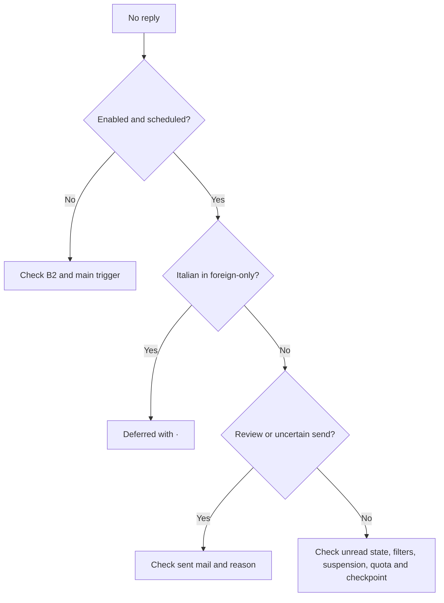

# Quick diagnosis

Updated 29 September 2026.

```mermaid
flowchart TD
 A[No reply] --> B{Enabled and scheduled?}
 B -->|No| C[Check B2 and main trigger]
 B -->|Yes| D{Italian in foreign-only?}
 D -->|Yes| E[Deferred with ·]
 D -->|No| F{Review or uncertain send?}
 F -->|Yes| G[Check sent mail and reason]
 F -->|No| H[Check unread state, filters, suspension, quota and checkpoint]
```

Do not remove send markers or lower thresholds before diagnosing the cause.

- [Full procedure](TROUBLESHOOTING.md)
- [Language modes](LANGUAGE_MODES.md)
- [Configuration](CONFIGURATION.md)
