# 🌳 Quick Decision Tree - What To Do If...

[](QUICK_DECISION_TREE_IT.md)

> **Visual guide for quickly solving the most common system problems**

---

## 🚨 Emergencies (Immediate Resolution)

```mermaid
graph TD
    A[🚨 Problem Detected] --> B{System responding?}
    B -->|NO| C[Check active trigger]
    B -->|YES but poorly| D[Check Verifica label]
    C --> E{Trigger present?}
    E -->|NO| F["setupTrigger()"]
    E -->|YES| G[Check Executions for errors]
    D --> H{">30% emails in Verifica?"}
    H -->|YES| I["Lower VALIDATION_MIN_SCORE"]
    H -->|NO| J[Review individual emails]
    G --> K{API Key error?}
    K -->|YES| L[Regenerate API key]
    K -->|NO| M[Check API quota]
```



---

## 📊 Quick Decision Matrix

| Symptom | Probable Cause | Immediate Action | Reference Doc |
|---------|----------------|---------------|---------------|
| No emails processed | Trigger inactive | `setupTrigger()` | [DEPLOYMENT.md](DEPLOYMENT.md) |
| All emails in "Verifica" | Threshold too high | `VALIDATION_MIN_SCORE=0.5` | [TROUBLESHOOTING.md](../TROUBLESHOOTING.md#4) |
| API 429 errors | Quota exhausted | Wait for reset 9:00 AM PT | [gas_rate_limiter.js](../gas_rate_limiter.js) |
| Wrong language responses | Detection failed | Check `detectEmailLanguage()` | [TROUBLESHOOTING.md](../TROUBLESHOOTING.md#5) |
| System responds to newsletters | Insufficient filters | Add domains to `IGNORE_DOMAINS` | [gas_config.js](../gas_config.js) |
| Hallucinations (invented data) | Incomplete KB | Enrich Knowledge Base | [KNOWLEDGE_BASE_GUIDE.md](KNOWLEDGE_BASE_GUIDE.md) |
| Inappropriate tone | AI_CORE missing | Populate AI_CORE sheet | [KNOWLEDGE_BASE_GUIDE.md](KNOWLEDGE_BASE_GUIDE.md) |
| Memory not working | Corrupted sheet | Verify `ConversationMemory` structure | [TROUBLESHOOTING.md](../TROUBLESHOOTING.md#8) |

---

## 🔍 Complete Diagnostic Flow


---

## ⚡ Quick Fixes by Scenario

### Scenario 1: System Completely Stopped

```javascript
// 1. Quick diagnosis
function quickDiagnosis() {
  const triggers = ScriptApp.getProjectTriggers();
  console.log('Active triggers:', triggers.length);
  
  const apiKey = PropertiesService.getScriptProperties()
    .getProperty('GEMINI_API_KEY');
  console.log('API Key present:', !!apiKey);
  
  try {
    SpreadsheetApp.openById(CONFIG.SPREADSHEET_ID);
    console.log('✓ Sheet accessible');
  } catch(e) {
    console.error('❌ Sheet NOT accessible');
  }
}

// 2. Fix: Recreate trigger
setupTrigger();
```

### Scenario 2: Too Many Emails in "Verifica" (>30%)

```javascript
// Temporary action: lower threshold
// In gas_config.js:
CONFIG.VALIDATION_MIN_SCORE = 0.5;  // Was 0.6

// Permanent action: analyze logs for error patterns
function analyzeVerificaPatterns() {
  const verifyLabel = GmailApp.getUserLabelByName('Verifica');
  const threads = verifyLabel.getThreads(0, 20);
  // Check logs in "Executions" to see the reasons
}
```

### Scenario 3: API Quota Exhausted (Error 429)

```javascript
// Immediate action: use only economical model
CONFIG.MODEL_STRATEGY = {
  'quick_check': ['flash-lite'],
  'generation': ['flash-lite']  // Avoid flash-2.5
};

// Reduce load
CONFIG.MAX_EMAILS_PER_RUN = 3;

// Note: Quota resets at 9:00 AM Italian time (midnight Pacific)
```

### Scenario 4: Responses in Wrong Language

```javascript
// Test language detection
function testLanguageDetection() {
  const classifier = new Classifier();
  const result = classifier.detectEmailLanguage(
    'Email text to test', 
    'Email subject'
  );
  console.log('Detected language:', result.lang);
  console.log('Confidence:', result.confidence);
}
```

---

## 📋 Pre-Support Diagnostic Checklist

Before contacting support, verify:

- [ ] `emergencyDiagnostic()` executed and output saved
- [ ] Active trigger verified in Apps Script → Triggers
- [ ] Last 5 executions checked in Apps Script → Executions
- [ ] Valid API Key verified on [AI Studio](https://aistudio.google.com/apikey)
- [ ] API quota checked on [Google Cloud Console](https://console.cloud.google.com/apis)
- [ ] Knowledge Base spreadsheet accessibility verified
- [ ] `DRY_RUN` is set to `false` in production

---

## 🎯 Quick References

| Function | Use | Documentation |
|----------|-----|---------------|
| `setupTrigger()` | Recreate main trigger | [DEPLOYMENT.md](DEPLOYMENT.md) |
| `emergencyDiagnostic()` | Complete system diagnosis | [TROUBLESHOOTING.md](TROUBLESHOOTING.md) |
| `dailyHealthCheck()` | Daily status report | [DEPLOYMENT.md](DEPLOYMENT.md) |
| `testGeminiConnection()` | Test API connection | [DEPLOYMENT.md](DEPLOYMENT.md) |
| `fullDiagnostic()` | Complete diagnostic | [TROUBLESHOOTING.md](TROUBLESHOOTING.md) |

---

**[Versione Italiana](QUICK_DECISION_TREE_IT.md)** | **[Back to README](../README.md)**
