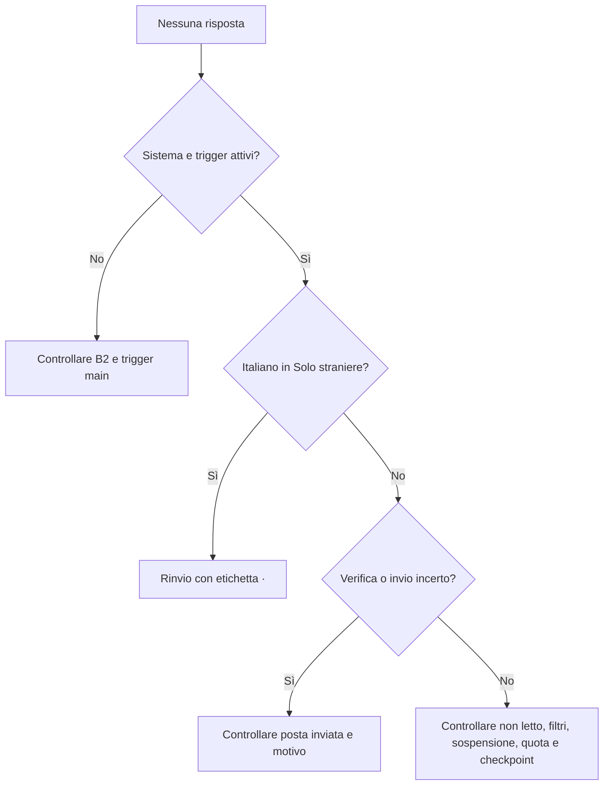

# Diagnosi rapida

Aggiornato al 3 October 2026.

```mermaid
flowchart TD
 A[Nessuna risposta] --> B{Sistema e trigger attivi?}
 B -->|No| C[Controllare B2 e trigger main]
 B -->|Sì| D{Italiano in Solo straniere?}
 D -->|Sì| E[Rinvio con etichetta ·]
 D -->|No| F{Verifica o invio incerto?}
 F -->|Sì| G[Controllare posta inviata e motivo]
 F -->|No| H[Controllare non letto, filtri, sospensione, quota e checkpoint]
```

Non rimuovere marker di invio né abbassare soglie prima di aver identificato la causa.

- [Procedura completa](TROUBLESHOOTING_IT.md)
- [Modalità lingua](LANGUAGE_MODES_IT.md)
- [Configurazione](CONFIGURATION_IT.md)
