# 🌳 Albero Decisionale Rapido - Cosa Fare Se...

> **Guida visiva per risolvere rapidamente i problemi più comuni del sistema**

---

## 🚨 Emergenze (Risoluzione Immediata)

```mermaid
graph TD
    A[🚨 Problema Rilevato] --> B{Sistema risponde?}
    B -->|NO| C[Controlla trigger attivo]
    B -->|SÌ ma male| D[Controlla label Verifica]
    C --> E{Trigger presente?}
    E -->|NO| F["setupTrigger()"]
    E -->|SÌ| G[Controlla Esecuzioni per errori]
    D --> H{">30% email in Verifica?"}
    H -->|SÌ| I["Abbassa VALIDATION_MIN_SCORE"]
    H -->|NO| J[Review singole email]
    G --> K{Errore API Key?}
    K -->|SÌ| L[Rigenera chiave API]
    K -->|NO| M[Controlla quota API]
```



---

## 📊 Matrice Decisionale Rapida

| Sintomo | Causa Probabile | Fix Immediato | Doc Riferimento |
|---------|-----------------|---------------|-----------------|
| Nessuna email processata | Trigger inattivo | `setupTrigger()` | [DEPLOYMENT_IT.md](../DEPLOYMENT_IT.md) |
| Email tutte in "Verifica" | Soglia troppo alta | `VALIDATION_MIN_SCORE=0.5` | [TROUBLESHOOTING_IT.md](../TROUBLESHOOTING_IT.md#4) |
| API 429 errors | Quota esaurita | Attendi reset 9:00 AM | [gas_rate_limiter.js L.234](../gas_rate_limiter.js) |
| Risposte in lingua sbagliata | Detection fallita | Verifica `detectEmailLanguage()` | [TROUBLESHOOTING_IT.md](../TROUBLESHOOTING_IT.md#5) |
| Sistema risponde a newsletter | Filtri insufficienti | Aggiungi domini a `IGNORE_DOMAINS` | [gas_config.js](../gas_config.js) |
| Allucinazioni (dati inventati) | KB incompleta | Arricchisci Knowledge Base | [KNOWLEDGE_BASE_GUIDE_IT.md](../KNOWLEDGE_BASE_GUIDE_IT.md) |
| Tono inappropriato | AI_CORE mancante | Popola foglio AI_CORE | [KNOWLEDGE_BASE_GUIDE_IT.md](../KNOWLEDGE_BASE_GUIDE_IT.md) |
| Memoria non funziona | Foglio corrotto | Verifica struttura `ConversationMemory` | [TROUBLESHOOTING_IT.md](../TROUBLESHOOTING_IT.md#8) |

---

## 🔍 Flusso Diagnostica Completo


---

## ⚡ Quick Fixes per Scenario

### Scenario 1: Sistema Completamente Fermo

```javascript
// 1. Diagnosi rapida
function quickDiagnosis() {
  const triggers = ScriptApp.getProjectTriggers();
  console.log('Trigger attivi:', triggers.length);
  
  const apiKey = PropertiesService.getScriptProperties()
    .getProperty('GEMINI_API_KEY');
  console.log('API Key presente:', !!apiKey);
  
  try {
    SpreadsheetApp.openById(CONFIG.SPREADSHEET_ID);
    console.log('✓ Sheet accessibile');
  } catch(e) {
    console.error('❌ Sheet NON accessibile');
  }
}

// 2. Fix: Ricrea trigger
setupTrigger();
```

### Scenario 2: Troppe Email in "Verifica" (>30%)

```javascript
// Fix temporaneo: abbassa soglia
// In gas_config.js:
CONFIG.VALIDATION_MIN_SCORE = 0.5;  // Era 0.6

// Fix permanente: analizza log per pattern errori
function analyzeVerificaPatterns() {
  const verifyLabel = GmailApp.getUserLabelByName('Verifica');
  const threads = verifyLabel.getThreads(0, 20);
  // Controlla i log in "Esecuzioni" per vedere i motivi
}
```

### Scenario 3: Quota API Esaurita (Errore 429)

```javascript
// Fix immediato: usa solo modello economico
CONFIG.MODEL_STRATEGY = {
  'quick_check': ['flash-lite'],
  'generation': ['flash-lite']  // Evita flash-2.5
};

// Riduce carico
CONFIG.MAX_EMAILS_PER_RUN = 3;

// Nota: Quota si resetta alle 9:00 italiane
```

### Scenario 4: Risposte in Lingua Sbagliata

```javascript
// Test detection lingua
function testLanguageDetection() {
  const classifier = new Classifier();
  const result = classifier.detectEmailLanguage(
    'Testo email da testare', 
    'Oggetto email'
  );
  console.log('Lingua rilevata:', result.lang);
  console.log('Confidenza:', result.confidence);
}
```

---

## 📋 Checklist Diagnostica Pre-Supporto

Prima di contattare il supporto, verifica:

- [ ] `emergencyDiagnostic()` eseguito e output salvato
- [ ] Trigger attivo verificato in Apps Script → Trigger
- [ ] Ultime 5 esecuzioni controllate in Apps Script → Esecuzioni
- [ ] API Key valida verificata su [AI Studio](https://aistudio.google.com/apikey)
- [ ] Quota API controllata su [Google Cloud Console](https://console.cloud.google.com/apis)
- [ ] Spreadsheet Knowledge Base accessibile verificato
- [ ] `DRY_RUN` è impostato a `false` in produzione

---

## 🎯 Riferimenti Rapidi

| Funzione | Uso | Documentazione |
|----------|-----|----------------|
| `setupTrigger()` | Ricrea trigger principale | [DEPLOYMENT_IT.md](../DEPLOYMENT_IT.md) |
| `emergencyDiagnostic()` | Diagnosi completa sistema | [TROUBLESHOOTING_IT.md](../TROUBLESHOOTING_IT.md) |
| `dailyHealthCheck()` | Report stato quotidiano | [DEPLOYMENT_IT.md](../DEPLOYMENT_IT.md) |
| `testGeminiConnection()` | Test connessione API | [DEPLOYMENT_IT.md](../DEPLOYMENT_IT.md) |
| `fullDiagnostic()` | Diagnostica completa | [TROUBLESHOOTING_IT.md](../TROUBLESHOOTING_IT.md) |

---

**[English Version](QUICK_DECISION_TREE.md)** | **[Torna a README](../README_IT.md)**
